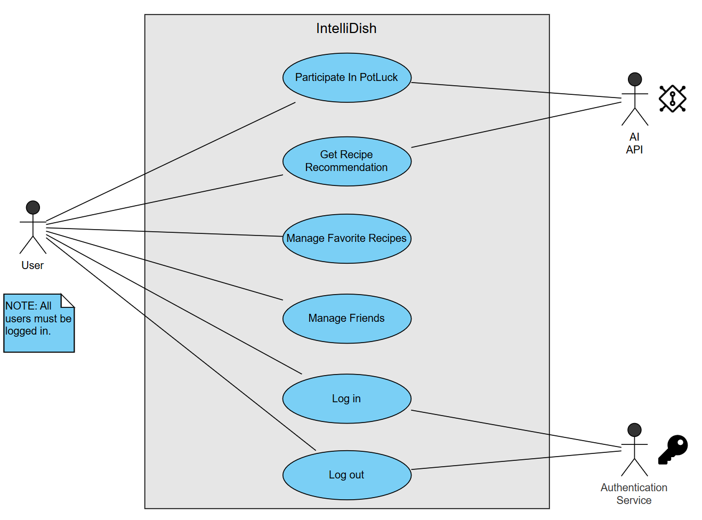
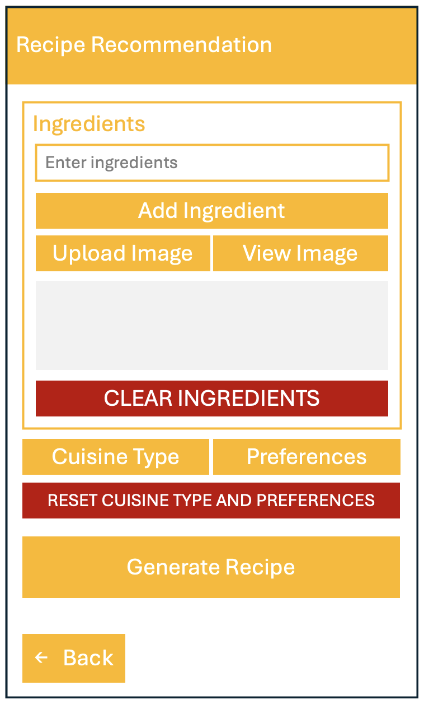
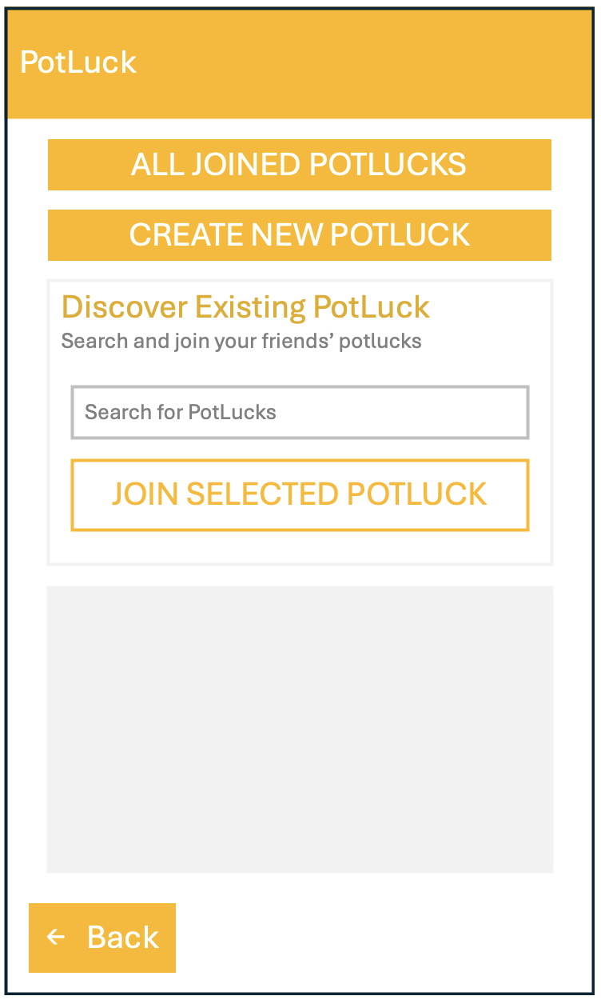
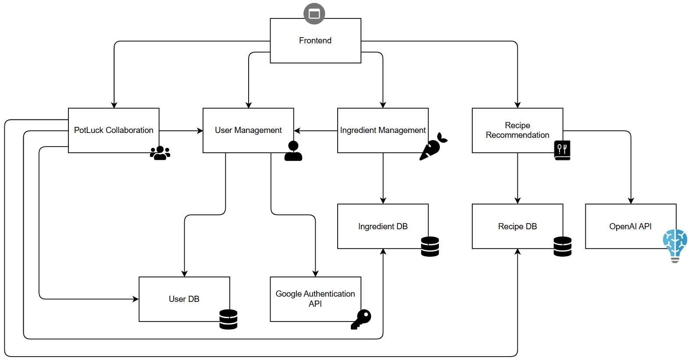
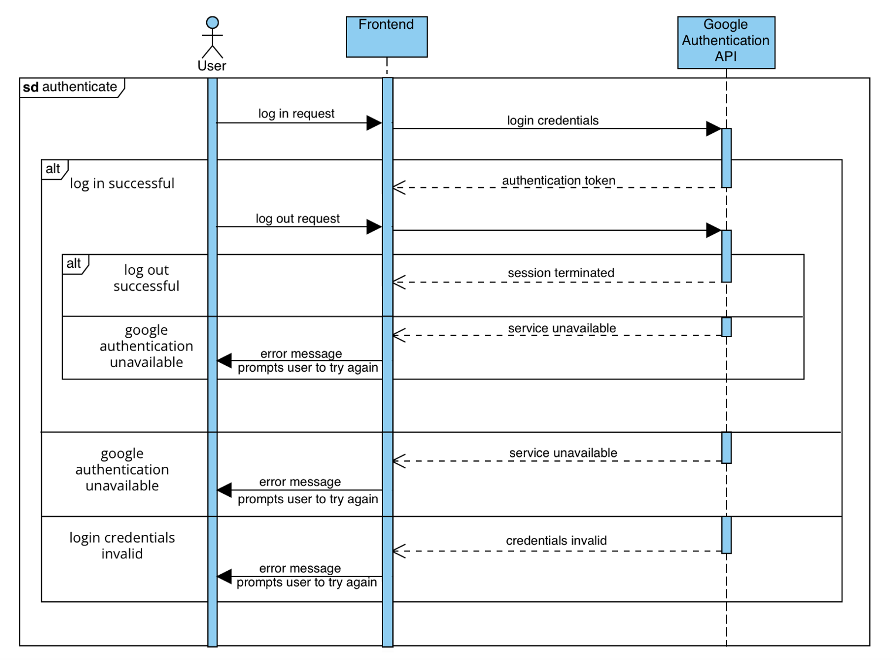
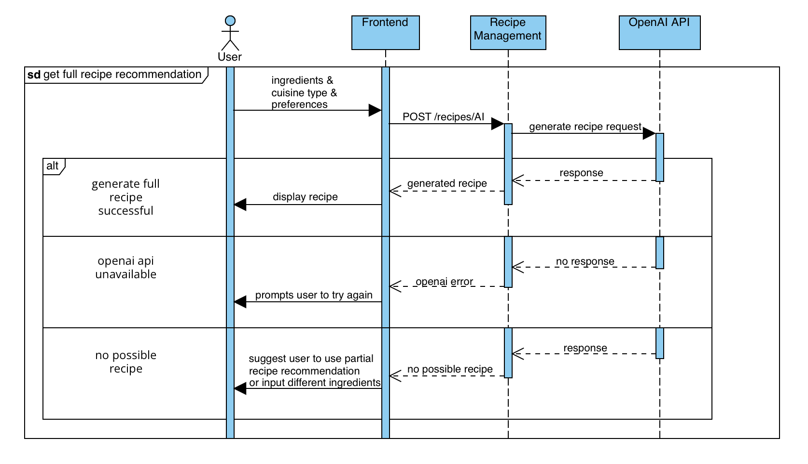
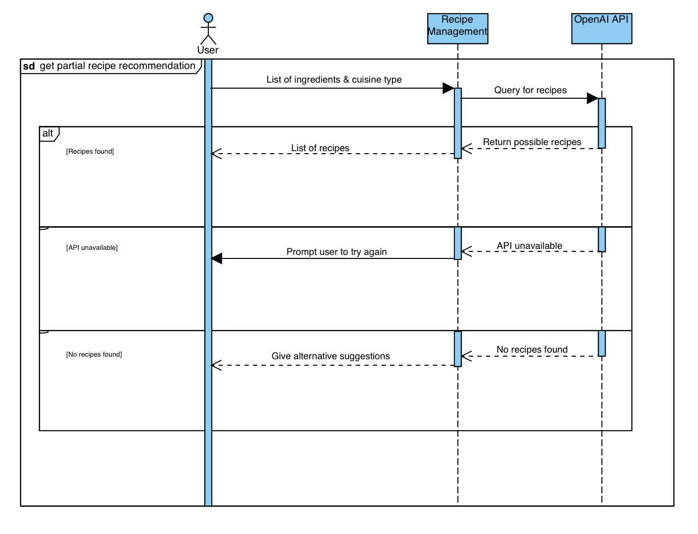
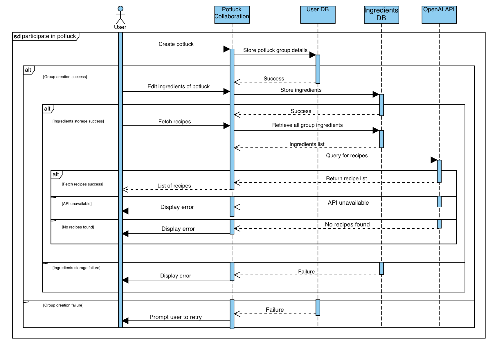
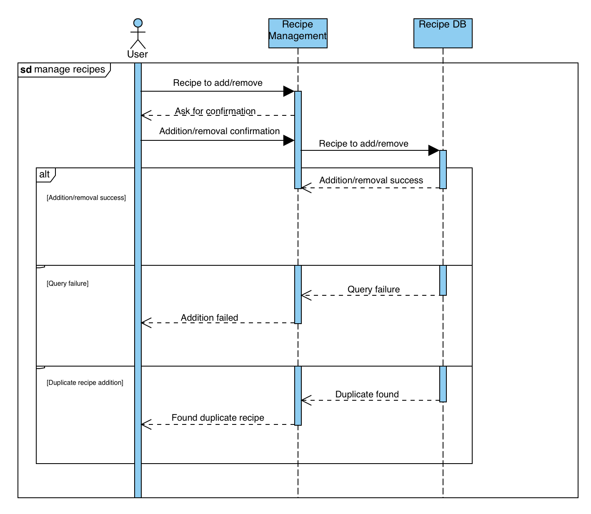
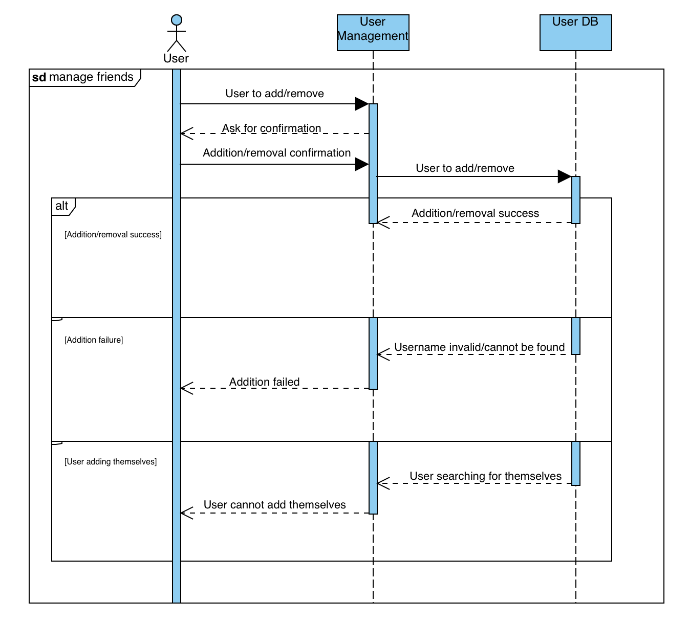

# M3 - Requirements and Design

## 1. Change History
Feb 24: 
- Revised the use case diagram in Section 3.1 by consolidating login and logout into a single authentication use case.
- Revised Section 3.5.1 to simplify the security approach by removing AES and RSA references, focusing on HTTPS and trusted libraries for robust protection without added complexity.
- Revised Section 3.5.2 to justify the four-click limit for user actions based on usability studies, emphasizing improved user satisfaction, task efficiency, and a user-friendly interface.
- Revised Section 4.5 to separate frontend, backend, and external component (Databases and APIs) using dotted lines.
- Revised Section 4.7.1 according to revision in Section 3.5.1.
- Revised Section 4.7.2 according to revision in Section 3.5.2.

Feb 28:
- Revised Section 3.2 "Authenticate" use case to align with the consolidation made in the use case diagram.
- Revised Section 3.5.3 to align with industry best practices by reducing the response time target from 10 seconds to 5 seconds, ensuring a more responsive user experience.
- Revised Sectiin 4.7.3 according to revision in Section 3.5.3.
- Revised Section 3.4 to reflect the updated user interface design with enhanced clarity and functionality.
- Revised Section 4.2 to align with the current MongoDB schema, incorporating Mongoose for schema validation, middleware-based lifecycle management, and automated referential integrity.
- Revised Section 4.4 to include Firebase Cloud Messaging (FCM) for real-time notifications and live updates, enhancing user engagement and responsiveness.
- Revised Section 3.2 "Participate in PotLuck" use case to clarify the flow, incorporating group creation, invitations, and real-time updates.
- Revised Section 4.8 to replace the previous recipe ranking algorithm with a stable matching algorithm for Potluck, ensuring group-based recipe selection optimizes overall satisfaction and resolves conflicting preferences dynamically.

Feb 29:
- Revised Section 4.1 to provide clearer rationale for separating the main components and updated each interface to align with the latest implementation details.
- Revised Section 4.5 to capture the updated interactions between components.

## 2. Project Description
Our app “IntelliDish - AI Powered Recipe Recommendations Taylored for your Stomach and Fridge” aims to solve challenges faced by people with busy schedules and limited access to diverse cooking ingredients. 

IntelliDish allows users to give a list of available ingredients to IntelliDish along with the type of cuisine they wish to cook (such as Chinese food, Italian food, etc.), and IntelliDish will return a number of recipes that are possible to create with the available ingredients. If no recipes can be made with the provided ingredients, IntelliDish will return recipes where ingredients are partially available and give suggestions to the users on additional ingredients to buy or possible ingredient replacements. Additionally, IntelliDish will also provide many useful features such as personalizing friend lists, personalizing favorite recipes, and participating in potluck (which allows multiple users to combine their available ingredients and search for recipes).

For users like busy university students and employees (who often lack the time, energy, cooking expertise, and recipe knowledge to plan meals), IntelliDish simplifies the meal preparation process by providing quick and desirable recipe suggestions using available ingredients. Additionally, for those with restricted ingredient options due to location or budget constraints, IntelliDish can maximize the value of available ingredients, allowing users to create desirable meals with limited access to diverse cooking ingredients.

<p align="center">
  
  
</p>

## 3. Requirements Specification
### **3.1. Use-Case Diagram**



### **3.2. Actors Description**
1. **User**  
   - The user provides the IntelliDish app with inputs such as available ingredients and cuisine preferences. The user can also manage their recipes and friends.  
   - For now, we have made the design choice that all users need to log in to use IntelliDish.  

2. **AI API**  
   - Provides possible recipes based on user input.  

3. **Authentication Service**  
   - Manages user login and logout.  

### **3.3. Functional Requirements**
<a name="fr1"></a>

**Overview**:
1. **Authenticate**
    * User logs into and out of IntelliDish using the authentication service to manage their session securely.
2. **Get Full Recipe Recommendation**
    * User provides a list of available ingredients and cuisine preferences, and the AI API returns a list of possible recipes.
3. **Get Partial Recipe Recommendation**
    * Suggest recipes where some ingredients are missing from user input, and provide possible substitutes for missing ingredients as well as possible recipes that doesn't match the user's cuisine preferences.
4. **Participate In PotLuck**
    * Users can collaboratively input available ingredients as a group for recipe recommendations.
5. **Manage Recipes**
    * Users can add or remove recipes.
6. **Manage Friends**
    * Users can add or remove friends, with whom they can PotLuck and share recipes with.

**Detailed Flow for Each Independent Scenario**:

1. **Authenticate**
    - **Description**: User logs in to and logs out from IntelliDish using the authentication service to manage their session securely.
    - **Primary actor(s)**: User, Authentication Service.
    - **Main success scenario:**  
        - **1**. Upon opening the app, the user is on the login page. The user clicks "Sign In" and enters their credentials on the authentication service login page.  
        - **2**. The authentication service validates the user's credentials.  
        - **3**. The user successfully logs in to IntelliDish and starts using the system.  
        - **4**. When the user wants to log out, they select "Log Out" from the main page.  
        - **5**. The authentication service terminates the user's session.  
        - **6**. User session data (tokens, cookies, etc.) are cleared for security purposes.  
        - **7**. The user is redirected to the login screen after logging out.
    - **Failure scenario(s):**  
        - **1a**: Authentication service is unreachable/unavailable during login.
          - **1a1**: Display an error message that the authentication service is unreachable/unavailable.
          - **1a2**: Prompt the user to try again later or check online if the authentication service is down/under maintenance.  
        - **2a**: Authentication service determines that the user's credentials are invalid.
          - **2a1**: Display an error message that credentials are invalid.
          - **2a2**: Prompt the user to try again.
        - **4a**: Authentication service is unreachable/unavailable during logout, and session termination fails.
          - **4a1**: Display an error message that the authentication service is unreachable/unavailable.
          - **4a2**: Prompt the user to try again later or check online if the authentication service is down/under maintenance.

2. **Get Full Recipe Recommendation**:
    - **Description**: User provides a list of available ingredients and cuisine preferences, and the AI API returns a list of possible recipes.
    - **Primary actor(s)**: User, AI API.
    - **Main success scenario**:
        - **1**. The user provides a list of available ingredients and cuisine preferences to IntelliDish.
        - **2**. A request to the AI API is made based on the user's inputs.
        - **3**. The AI API returns a list of possible recipes to the user.
    - **Failure scenario(s)**:
        - **2a**: The AI API is unreachable/ unavailable.
            - **2a1**: Display error message that the AI API is unreachable/ unavailable.
            - **2a2**: Prompt the user to try again later, or check online whether the AI API is down/ under maintainence.
        - **2b**: No recipes are possible for the provided user inputs.
            - **2b1**: Suggest the user to use partial recipe recommendations, PotLuck with friends, or try again with different inputs instead.

3. **Get Partial Recipe Recommendation**:
    - **Description**: Suggest recipes where some ingredients are missing from user input, and provide possible substitutes for missing ingredients as well as possible recipes that doesn't match the user's cuisine preferences.
    - **Primary actor(s)**: User, AI API.
    - **Main success scenario**:
        - **1**. The user provides a list of available ingredients and cuisine preferences to IntelliDish.
        - **2**. A request to the AI API is made based on the user's inputs.
        - **3**. The AI API determines that there are no possible recipes based on the user's input.
        - **4**. The AI API suggests recipes where some ingredients are missing from user input, and provide possible substitutes for missing ingredients as well as possible recipes that doesn't match the user's cuisine preferences.
    - **Failure scenario(s)**:
        - **2a**: The AI API is unreachable/ unavailable.
            - **2a1**: Display error message that the AI API is unreachable/ unavailable.
            - **2a2**: Prompt the user to try again later, or check online whether the AI API is down/ under maintainence.
        - **2b**: No recipes are possible for the provided user inputs.
            - **2b1**: Suggest the user to use PotLuck with friends, or try again with different inputs instead.

4. **Participate In PotLuck**:
    - **Description**: Users collaboratively contribute available ingredients for group-based recipe recommendations while managing group creation, invitations, and participant interactions.
    - **Primary actor(s)**: User, AI API.
    - **Main success scenario**:
        - **1**. A user starts a PotLuck and invites their friends to create a group.
        - **2**. Invited users accept or decline the invitation.
        - **3**. Each user independently adds or removes their ingredient contributions and sets cuisine type and preferences within the PotLuck group. Live updates ensure real-time synchronization across all participants.
        - **4**. A request is sent to the AI API based on the combined user inputs.
        - **5**. The AI API returns a list of possible recipes based on the collective ingredients.
    - **Failure scenario(s)**:
        - **1a**: Group creation failed.
            - **1a1**: Display an error message indicating the reason for failure (e.g., duplicate PotLuck name, server issues, or invalid invitations).
            - **1a2**: Prompt the user to retry with a different name or check server status.
        - **1b**: Invitation handling failure.
            - **1b1**: Display an error message if an invitee’s account is unavailable or already part of another group.
            - **1b2**: Notify the inviter if an invitee declines the invitation.
        - **3a**: A user attempts to delete another user’s contributions.
            - **3a1**: Display an error message stating that users can only modify their own contributions.
        - **4a**: The AI API is unreachable/unavailable.
            - **4a1**: Display an error message that the AI API is unreachable/unavailable.
            - **4a2**: Prompt the users to try again later or check online whether the AI API is down/under maintenance.
        - **5a**: No recipes are possible for the provided user inputs.
            - **5a1**: Suggest the users use partial recipe recommendations or modify their ingredient list.

5. **Manage Recipes**:
    - **Description**: Users can add or remove recipes.
    - **Primary actor(s)**: User.
    - **Main success scenario**:
        - **1**. The user selects a recipe from past queries to add to their list of saved recipes, or selects an existing recipe from their list of saved recipes to remove.
        - **2**. System asks the user for confirmation of action.
        - **3**. The user's list of saved recipes is updated with the addition/ removal of a recipe.
    - **Failure scenario(s)**:
        - **1a**: The addition of a recipe fails due to issues with accessing past query data.
            - **1a1**: Display error message that the addition failed, and prompt the user to try again. Removal of recipes do not fail.
        - **1b**: The user attempts to add a duplicate recipe.
            - **1b1**: Display error message that the recipe is already in the user's saved recipes list.

6. **Manage Friends**:
    - **Description**: Users can add or remove friends, with whom they can PotLuck and share recipes with.
    - **Primary actor(s)**: User.
    - **Main success scenario**:
        - **1**. The user enters the username of a user to add as a friend, or the user chooses a user from his/ her existing friend list to remove.
        - **2**. System asks the user for confirmation of action.
        - **3**. The user's friend list is updated with the addition/ removal of a friend.
    - **Failure scenario(s)**:
        - **1a**: The friend addition fails because the entered username is invalid/ cannot be found.
            - **1a1**: Display error message for the user to double check that the entered username for friend addition is correct, and prompt the user to try again. Removal of friends do not fail.
        - **1b**: The user attempts to add themselves as a friend.
            - **1b1**: Display error message that the user cannot add himself/ herself as a friend.

### **3.4. Screen Mockups**
These screen mockups illustrate the user interfaces for the Full Recipe Recommendation, Partial Recipe Recommendation, and Participate in PotLuck use cases.
- On the Recipe Recommendation page, users can manually add ingredients or upload a photo of their fridge. Once the ingredients are set, clicking the "Generate" button sends a request to the AI API, which processes and returns possible recipes.
- On the PotLuck page, users can browse, search for, join, or create potluck groups, enabling social meal planning and collaboration.

<p align="center">
  
  
</p>

### **3.5. Non-Functional Requirements**
<a name="nfr1"></a>

1. **Data Security**
    - **Description**: All user data—including login credentials, friend lists, query history, and saved recipes—should be securely transmitted using HTTPS to ensure data confidentiality during communication. Sensitive information is handled using trusted libraries and APIs that follow industry best practices for security. Additionally, user session data (e.g., tokens, cookies) should be managed securely and cleared upon user logout to prevent unauthorized access.
    - **Justification**: Using HTTPS ensures secure communication between the client and server, protecting data in transit. Relying on well-established libraries and security standards at the application and database levels helps safeguard sensitive information at rest. These measures enhance user privacy and build trust in IntelliDish when handling personal data such as login credentials, preferences, and location information.
2. **Usability/ Ease of Use**
    - **Description**: All user actions—such as inviting friends to PotLuck, adding or removing friends, and adding ingredients—should be completed in no more than four clicks. This limit is based on usability studies that indicate increased click numbers can lead to user frustration and decreased engagement. According to [this study](https://medium.com/@gizemkorpinar/impact-of-click-number-on-user-experience-fab78e1f2a91), keeping the number of clicks low improves user satisfaction and task efficiency.
    - **Justification**: IntelliDish aims to provide an intuitive, user-friendly interface with a low learning curve to attract and retain users of varying technological backgrounds. Limiting the number of clicks required for common actions helps streamline user workflows, reduce cognitive load, and enhance the overall user experience.

3. **Performance**
    - **Description**: 90% of user recipe queries should receive a response in less than 5 seconds. This accounts for worst-case scenarios such as heavy backend loads, API call failures, and/or extremely long or complex ingredient lists.
    - **Justification**: IntelliDish should aim to maintain fast response times to enhance user experience, increase retention, and sustain engagement. According to [this article](https://odown.com/blog/what-is-a-good-api-response-time/?utm_source=chatgpt.com#conclusion), users begin to perceive delays beyond 1 second, and response times exceeding 5 seconds are associated with increased frustration and potential abandonment. Industry best practices suggest that API response times between 2 to 5 seconds are tolerable for non-critical applications but should be optimized for user satisfaction.


## 4. Designs Specification
### **4.1. Main Components**
1. **User Management Component**
    - **Purpose**: Manages the creation, retrieval, updating, and deletion of users. It also handles friend relationships (adding/removing friends) and manages user-associated recipes and ingredients.
    - **Rationale**: Centralizing these operations simplifies maintenance, security, and scaling. It also streamlines integration with external authentication (like Google OAuth) and facilitates future expansion of user-related features.
    - **Interfaces**: 
        1. `List<User> getUsers();`
            - **Purpose**: Fetches a list of all users.
        2. `User getUserById(String userId);`
            - **Purpose**: Retrieves a single user based on their MongoDB ObjectId.
        3. `User getUserByEmail(String email);`
            - **Purpose**: Retrieves a single user using their email address.
        4. `String createNewUser(User userData);`
           - **Purpose**: Creates a new user record in the database. Returns the user’s newly assigned ID on success.
        5. `boolean updateUserName(String userId, String newName);`
           - **Purpose**: Updates a user's name if the user exists.
        6. `boolean deleteUserAccount(String userId);`
           - **Purpose**: Removes a user record from the database.
        7. `boolean addNewFriend(String userId, String friendId);`
            - **Purpose**: Establishes a mutual friend relationship between two users.
        8. `boolean deleteFriend(String userId, String friendId);`
            - **Purpose**: Removes an existing friend relationship between two users.
        9. `List<User> getFriends(String userId);`
            - **Purpose**: Returns a list of the user’s friends with optional friend detail (e.g., name, email).
        10. `boolean addRecipeToUser(String userId, String recipeId);`
            - **Purpose**: Associates an existing recipe with a user, storing only the recipe ID in the user’s recipes list.
        11. `boolean deleteRecipeFromUser(String userId, String recipeId);`
            - **Purpose**: Removes a recipe reference from a user’s saved recipes.
        12. `List<Recipe> getRecipes(String userId);`
            - **Purpose**: Retrieves the user’s associated recipes (populated from recipe IDs).
        13. `boolean addIngredientToUser(String userId, String ingredientId);`
            - **Purpose**: Adds a reference to an existing ingredient to the user’s ingredients list.
        14. `boolean deleteIngredientFromUser(String userId, String ingredientId);`
            - **Purpose**: Removes the given ingredient from the user’s ingredients list.
        15. `List<Ingredient> getIngredients(String userId);`
            - **Purpose**: Fetches all ingredients associated with a user.
   - **HTTP/REST Interfaces**:
     - GET /users – Retrieves all users.
     - POST /users – Creates a new user.
     - GET /users/id/{id} – Retrieves a user by ID.
     - PUT /users/{id}/name – Updates a user’s name.
     - PUT /users/{id}/addFriend – Adds a friend to a user’s list.
     - PUT /users/{id}/deleteFriend – Removes a friend from a user’s list.
     - GET /users/{id}/friends – Fetches a user’s friends.
     - DELETE /users/{id} – Deletes a user.
     - POST /users/{id}/recipe – Adds a recipe to the user’s saved list.
     - DELETE /users/{id}/recipe – Removes a recipe from a user’s saved list.
     - GET /users/{id}/recipes – Retrieves a user’s saved recipes.
     - POST /users/{id}/ingredient – Adds an ingredient to a user’s list.
     - DELETE /users/{id}/ingredient – Removes an ingredient from a user’s list.
     - GET /users/{id}/ingredients – Retrieves a user’s ingredients.
        
2. **Recipe Management Component**
   - **Purpose**: Manages the creation, retrieval, updating, and deletion of recipe records. It can also generate new recipes via AI (recipesGeneration), and fetch ingredient details associated with a given recipe.
   - **Rationale**:  Centralizing recipe operations simplifies the system architecture. By isolating all recipe-related functions, it becomes straightforward to add features like advanced recipe filtering, integration with external APIs, or extended AI capabilities.
   - **Interfaces**:
     1. `List<Recipe> getAllRecipes();`
        - **Purpose**: Fetches a list of all recipes from the database.
     2. `Recipe getRecipeById(String recipeId);`
        - **Purpose**: Retrieves a single recipe based on its MongoDB ObjectId.
     3. `List<Recipe> getRecipeByName(String recipeName);`
        - **Purpose**: Performs a case-insensitive search for recipes matching the specified name.
     4. `List<Ingredient> getIngredientsFromRecipeId(String recipeId);`
        - **Purpose**: Looks up all ingredient records corresponding to the names listed in a recipe.
     5. `String postNewRecipe(Recipe recipeData);`
        - **Purpose**: Creates a new recipe in the database. Returns the assigned ID upon successful creation.
     6. `List<Recipe> postNewRecipeFromAI(List<String> ingredients);`
        - **Purpose**: Uses an AI helper (recipesGeneration) to generate recipes from the supplied ingredients. Inserts any new recipes into the database.
     7. `boolean putRecipeById(String recipeId, Recipe updateData);`
        - **Purpose**: Updates an existing recipe by its ID, modifying fields such as name, ingredients, or instructions.
     8. `boolean deleteRecipeById(String recipeId);`
        - **Purpose**: Deletes an existing recipe record from the database.
    - **HTTP/REST Interfaces**:
      - GET /recipes - Retrieves all recipes in the database.
      - POST /recipes - Creates a new recipe record.
      - GET /recipes/id/{id} - Retrieves a single recipe by its ID.
      - GET /recipes/name?name={recipeName} - Retrieves all recipes matching a specific name (case-insensitive).
      - GET /recipes/{id}/getIngredientDetails - Returns all matching ingredient documents for a recipe’s ingredient names.
      - POST /recipes/AI - Generates recipes using AI from a list of ingredients, then inserts them into the database.
      - PUT /recipes/{_id} - Updates an existing recipe by ID.
      - DELETE /recipes/{_id} - Deletes a recipe by its ID.

3. **Ingredient Management Component**
   - **Purpose**: Manages the creation, retrieval, updating, and deletion of ingredient records in the database. It also handles AI-based ingredient recognition (ingredientsRecognition) and merges or splits ingredient entries based on name, unit, and quantity.
   - **Rationale**: A dedicated ingredient component provides a clear and scalable way to handle diverse ingredient operations. This includes:
     - Centralized “add or update” logic (creating a new ingredient if one does not exist, or updating quantity if it does).
     - Unit conversion for ingredients (e.g., grams to kilograms, mL to L).
     - AI-driven image processing to detect and parse ingredients from uploaded images.
   - **Interfaces**:
      1. `List<Ingredient> getAllIngredients();`
           - **Purpose**: Fetches a list of all ingredients from the database.
      2. `Ingredient getIngredientById(String ingredientId);`
           - **Purpose**: Retrieves a single ingredient based on its MongoDB ObjectId.
      3. `List<Ingredient> getIngredientByName(String name);`
           - **Purpose**: Retrieves all ingredients that match a given name (case-insensitive).
      4. `Ingredient postNewIngredient(Ingredient ingredientData);`
           - **Purpose**: Creates a new ingredient record or merges quantity with an existing ingredient if a matching name/unit is found.
      5. `boolean putIngredientById(String ingredientId, Ingredient updateData);`
           - **Purpose**: Updates an existing ingredient’s fields (e.g., quantity, category) based on the provided ID.
      6. `boolean deleteIngredientById(String ingredientId);`
           - **Purpose**: Removes a specific ingredient from the database by its ID.
      7. `boolean postIngredientsFromAI(String imgPath);`
           - **Purpose**: Invokes an AI service to recognize ingredients in the given image, then processes each recognized ingredient via the “add or update” logic.
   - **HTTP/REST Interfaces**:
     - GET /ingredients - Retrieves all ingredients from the database.
     - GET /ingredients/id/{id} - Retrieves a single ingredient by its MongoDB ObjectId.
     - GET /ingredients/name?name={name} - Retrieves all ingredients matching the specified name (case-insensitive).
     - POST /ingredients - Creates or updates an ingredient based on name, unit, and quantity.
     - POST /ingredients/AI - Parses ingredients from an uploaded image using AI, then adds or updates each ingredient record.
     - PUT /ingredients/{id} - Updates a specific ingredient’s fields.
     - DELETE /ingredients/{id} - Deletes a specific ingredient by its ID.

4. **PotLuck Collaboration Component**
   - **Purpose**: Allows multiple users to collaborate on a potluck event, pooling their ingredients to generate group-specific recipe recommendations. Tracks which user contributes which ingredients, and manages potluck-level details like participants, recipes, and the host.
   - **Rationale**: Isolating potluck logic in a separate module ensures clean separation of event-based collaboration from individual user actions.
   - **Interfaces**:
     1. `boolean createPotluckSession(String name, Date date, String hostId, List<String> initialParticipants);`
        - **Purpose**: Creates a new potluck event, specifying a host and optional initial participants. Persists the event and references in the host’s record.
     2. `List<Potluck> getPotluckSessions();`
        - **Purpose**: Retrieves all potluck sessions from the database.
     3. `Potluck getPotluckSessionsById(String potluckId);`
        - **Purpose**: Retrieves a single potluck session by its ID.
     4. `List<Potluck> getPotluckSessionsByHostId(String userId);`
        - **Purpose**: Fetches all potluck sessions where the specified user is the host.
     5. `List<Potluck> getPotluckSessionsByParticipantId(String userId);`
        - **Purpose**: Fetches all potluck sessions in which the specified user is a participant.
     6. `boolean addPotluckParticipants(String potluckId, List<String> participantIds);`
        - **Purpose**: Adds new participants to an existing potluck, if they are not already included.
     7. `boolean removePotluckParticipants(String potluckId, List<String> participantIds);`
        - **Purpose**: Removes one or more participants from a potluck, also removing their contributed ingredients from the potluck’s overall list.
     8. `boolean addPotluckIngredientsToParticipant(String potluckId, String participantId, List<String> ingredients);`
        - **Purpose**: Adds ingredient names to a participant’s contributed list, and merges them into the potluck’s global ingredients set.
     9. `boolean removePotluckIngredientsFromParticipant(String potluckId, String participantId, List<String> ingredients);`
        - **Purpose**: Removes specific ingredients from the participant’s list and, if no longer contributed by any participant, from the potluck itself.
     10. `List<Recipe> updatePotluckRecipesByAI(String potluckId);`
        - **Purpose**: Gathers the potluck’s global ingredients, calls the AI helper for recipe generation, and adds the resulting recipes to the potluck’s recipes array.
     11. `boolean endPotluckSession(String potluckId);`
        - **Purpose**: Terminates a potluck session by removing it from the database and clearing any references from the host’s user record.
   - **HTTP/REST Interfaces**:
     - GET /potluck – Retrieves all potluck sessions.
     - GET /potluck/{id} – Retrieves a potluck by ID.
     - GET /potluck/host/{id} – Retrieves potlucks by host ID.
     - GET /potluck/participant/{id} – Retrieves potlucks by participant ID.
     - POST /potluck – Creates a new potluck session.
     - PUT /potluck/{id}/participants – Adds participants to a potluck.
     - DELETE /potluck/{id}/participants – Removes participants from a potluck.
     - PUT /potluck/{id}/ingredients – Adds ingredients for a given participant.
     - DELETE /potluck/{id}/ingredients – Removes ingredients for a given participant.
     - PUT /potluck/AI/{id} – Generates recipes via AI and updates the potluck.
     - DELETE /potluck/{id} – Ends (deletes) a potluck session.

### **4.2. Databases**
1. **MongoDB Database**
    - **Purpose**: Stores user data, including credentials, preferences, friend lists, recipes, ingredient lists, and potluck information. The database enables seamless integration with TypeScript through Mongoose, ensuring type safety, schema validation, and middleware-based lifecycle management while handling dynamic and unstructured data efficiently.
    -  **Rationale**: MongoDB’s document-based schema offers flexibility for handling hierarchical and unstructured data, such as recipes and ingredient metadata. By leveraging Mongoose, the schema ensures robust validation, optimized queries, and seamless updates when user-related documents are deleted or modified. Mongoose middleware functions facilitate automated referential integrity, such as removing references to deleted users, recipes, or ingredients, ensuring data consistency across collections.
    ##### **Database Collections**

    ##### **Users (`/users`)**
    ```
    [
        {
            "_id": ObjectId,
            "email": String,
            "name": String,
            "friends": [ObjectId],
            "recipes": [ObjectId],
            "ingredients": [ObjectId],
            "potluck": [ObjectId]
        }
    ]
    ```

    ##### **Recipes (`/recipes`)**
    ```
    [
        {
            "_id": ObjectId,
            "name": String,
            "ingredients": [String],
            "procedure": [String],
            "cuisineType": String,
            "recipeComplexity": "Don't Care" | "Very Easy" | "Easy" | "Medium" | "Hard" | "Very Hard",
            "preparationTime": Number, // Time in minutes
            "calories": Number, // Total calories per serving
            "price": Number
        }
    ]
    ```

    ##### **Ingredients (`/ingredients`)**
    ```
    [
        {
            "_id": ObjectId,
            "name": String,
            "category": "Vegetables" | "Fruit" | "Whole Grains" | "Meats" | "Eggs" | "Dairy" | "Condiments" | "Others",
            "quantity": Number,
            "unit": "g" | "kg" | "ml" | "l" | "tsp" | "tbsp" | "cup" | "pcs"
        }
    ]
    ```

    ##### **Potluck (`/potluck`)**
    ```
    [
        {
            "_id": ObjectId,
            "name": String,
            "date": Date,
            "host": ObjectId,
            "participants": [{ "user": ObjectId, "ingredients": [String] }],
            "ingredients": [String],
            "recipes": [ObjectId]
        }
    ]
    ```

### **4.3. External Modules**
1. **OPENAI API** 
    - **Purpose**: Processes user-provided inputs such as ingredients and cuisine preferences to generate personalized recipe suggestions using advanced NLP.
    - **Rational**: OpenAI’s powerful GPT-based models provide high-quality, context-aware recommendations, enabling features like partial recipe suggestions and ingredient substitutions.
2. **Google Authentication**
   - **Purpose**: Manages secure user login using Google accounts for authentication.
   - **Rational**: Google Authentication is widely trusted, simplifies user onboarding, and reduces the need to manage passwords manually. The Google sign-in Process can be directly handled using native libraries in frontend implementation.

### **4.4. Frameworks**
1. **Frontend Framework: Kotlin (Android)**
    - **Purpose**: Develop a native Android application to deliver an optimized, responsive, and user-friendly interface for mobile users.
    - **Reason**: Kotlin is the standard for Android development, offering seamless integration with Android SDK and native performance.
2. **Backend Framework: Node.js (TypeScript)**
   - **Purpose**: Implements the server-side logic to handle API requests, manage the database, and integrate external services like OpenAI.
    - **Reason**: Node.js with TypeScript ensures scalability, maintainability, and type safety.
3. **Cloud Service: AWS**
   - **Purpose**: Hosts the backend (Node.js).
   - **Reason**: AWS offers robust free-tier options, scalability, and integration flexibility for deploying and managing EC2 instances. It complies with the project constraints and ensures reliability and availability.
4. **Live Updates: Firebase Cloud Messaging (FCM)**
   - **Purpose**: Enables real-time notifications and live updates for users, such as recipe status changes and potluck activity updates.
   - **Reason**: FCM provides a scalable and reliable push notification service that integrates seamlessly with Android and Node.js, enhancing real-time user engagement.

### **4.5. Dependencies Diagram**


### **4.6. Functional Requirements Sequence Diagram**
1. [**Authenticate**](#fr1)\

2. [**Get Full Recipe Recommendation**](#fr1)\

3. [**Get Partial Recipe Recommendation**](#fr1)\

4. [**Participate In PotLuck**](#fr1)\

5. [**Manage Recipes**](#fr1)\

6. [**Manage Friends**](#fr1)\


### **4.7. Non-Functional Requirements Design**
1. [**Data Security**](#nfr1)
    - **Validation**: Use Transport Layer Security (TLS) (via HTTPS) to secure user data in transit. Verify the implementation through penetration testing and static code analysis to ensure compliance with security standards and best practices. Trusted libraries and APIs should be used for secure data handling at the application and database levels.
2. [**Usability/Ease of Use**](#nfr1)
    - **Validation**: Conduct usability tests with diverse user groups to ensure that key actions—such as recipe searching or PotLuck creation—can be completed in no more than four clicks, aligning with usability research on optimal interaction limits. Implement contextual tooltips and real-time error handling to guide users and enhance overall ease of use and task efficiency.
3. [**Performance**](nfr1)
    - **Validation**: Use stress testing tools like JMeter or Locust to simulate real-world usage scenarios. Optimize performance by implementing caching, query tuning, and load balancing to ensure 90% of API requests complete within 5 seconds under expected loads.


### **4.8. Main Project Complexity Design - Stable Matching Algorithm for Potluck**
**Description:**

Instead of ranking recipes individually based on a single user's preferences, we implement a stable matching algorithm to optimize group-based recipe selection for Potluck sessions. Each participant in a Potluck session specifies their preferred cuisine type and recipe attributes, including:

- Preparation time
- Recipe complexity
- Nutritional value
- Number of calories
- Spice level
- Price

The system will determine the best possible recipe that maximizes group satisfaction, ensuring a fair balance between each participant’s preferences.

**Why complex?**

1. Multi-User Optimization:
   - Unlike a single-user ranking system, this approach must accommodate multiple users with potentially conflicting preferences.
   - The system must ensure that no individual is disproportionately unsatisfied while maximizing overall happiness.

2. Stable Matching Algorithm:
   - Inspired by the Gale-Shapley algorithm, the system aims to find a stable match between participants' preferences and recipe options.
   - A recipe is considered stable if no subset of participants would collectively prefer a different recipe over the one selected.

3. Handling Conflicting Preferences:
   - The system must balance trade-offs when different participants prioritize different recipe attributes.
   - If one participant values low preparation time while another prioritizes high nutritional value, the algorithm seeks a compromise that best satisfies both.

**Design**:

Input:
- User Preferences (Per Participant in Potluck Group):
  - Preferred cuisine type
  - Preferred recipe attributes (1-10 scale, or “don’t care”)
- List of Available Recipes from AI API:
  - Recipe name
  - Recipe metadata (Preparation time, Recipe complexity, Nutritional value, Calories, Spice level, Price, Cuisine type)

Output:
- A stable, optimized recipe selection that best matches the collective preferences of the group.

**Main computational logic**:


1. Preference Weighting:
   - Each participant’s input is assigned a weight based on their preference intensity.
   - “Don’t care” attributes are ignored.
2. Pairing Algorithm:
   - Apply a stable matching algorithm that iteratively adjusts the selection to improve group satisfaction.
   - If a better match is found (i.e., another recipe that increases overall happiness without severely impacting any individual’s preference), the algorithm swaps selections.
3. Conflict Resolution:
   - If conflicting preferences exist (e.g., one participant prefers spicy food while another does not), the system finds a compromise recipe that minimizes dissatisfaction.
4. Final Selection:
   - The recipe that results in the most stable and fair match across all users is selected.

**Pseudo-code**:

```
FUNCTION stable_match_potluck(user_preferences, recipe_list):
    // Step 1: Assign Weights Based on User Preferences
    weights ← Normalize user preferences to ensure fair balance

    stable_recipe ← None
    best_happiness_score ← 0

    // Step 2: Iterate Through Recipes to Find Optimal Match
    FOR each recipe IN recipe_list DO
        group_happiness ← 0

        FOR each user IN user_preferences DO
            user_happiness ← Compute match score between recipe and user preferences
            group_happiness ← group_happiness + user_happiness

        // Step 3: Check Stability of Current Selection
        IF group_happiness > best_happiness_score THEN
            stable_recipe ← recipe
            best_happiness_score ← group_happiness

    // Step 4: Return the Best Recipe Selection
    RETURN stable_recipe
```

## 5. Contributions
**TLDR**: Work was distributed evenly among team members, and all members are satisfied.
- Allison Jiao
    - section 2
    - section 3.2
    - section 3.4
    - section 3.5
    - section 4.2
- Edward Han
    - section 2
    - section 3.1
    - section 3.2
    - section 3.3
    - section 4.8

- Angela Gao
    - section 4.1
    - section 4.5
    - section 4.6
    - section 4.7 
    - section 4.8

- Yixi Lu
    - section 4.1
    - section 4.2
    - section 4.3
    - section 4.4
    - section 4.6
