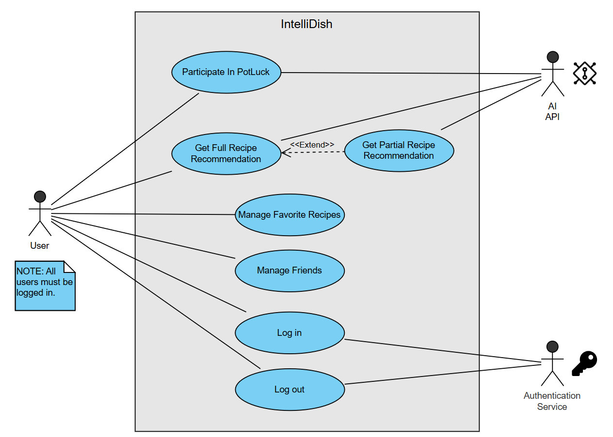

# M3 - Requirements and Design

## 1. Change History
<!-- Leave blank for M3 -->
Not applicable for this milestone.

## 2. Project Description
Our app “IntelliDish - AI Powered Recipe Recommendations Taylored for your Stomach and Fridge” aims to solve challenges faced by people with busy schedules and limited access to diverse cooking ingredients. 

IntelliDish allows users to give a list of available ingredients to IntelliDish along with the type of cuisine they wish to cook (such as Chinese food, Italian food, etc.), and IntelliDish will return a number of recipes that are possible to create with the available ingredients. If no recipes can be made with the provided ingredients, IntelliDish will return recipes where ingredients are partially available and give suggestions to the users on additional ingredients to buy or possible ingredient replacements. Additionally, IntelliDish will also provide many useful features such as personalizing friend lists, personalizing favorite recipes, and participating in potluck (which allows multiple users to combine their available ingredients and search for recipes).

For users like busy university students and employees (who often lack the time, energy, cooking expertise, and recipe knowledge to plan meals), IntelliDish simplifies the meal preparation process by providing quick and desirable recipe suggestions using available ingredients. Additionally, for those with restricted ingredient options due to location or budget constraints, IntelliDish can maximize the value of available ingredients, allowing users to create desirable meals with limited access to diverse cooking ingredients.

<p align="center">
  
  
</p>

## 3. Requirements Specification
### **3.1. Use-Case Diagram**



### **3.2. Actors Description**
1. **User**  
   - The user provides the IntelliDish app with inputs such as available ingredients and cuisine preferences. The user can also manage their recipes and friends.  
   - For now, we have made the design choice that all users need to log in to use IntelliDish.  

2. **AI API**  
   - Provides possible recipes based on user input.  

3. **Authentication Service**  
   - Manages user login and logout.  

### **3.3. Functional Requirements**
<a name="fr1"></a>

**Overview**:
1. **Log in**
    * User logs in to IntelliDish using the authentication service with his/her credentials.
2. **Log out**
    * User logs out from IntelliDish and the user session is terminated.
3. **Get Full Recipe Recommendation**
    * User provides a list of available ingredients and cuisine preferences, and the AI API returns a list of possible recipes.
4. **Get Partial Recipe Recommendation**
    * Suggest recipes where some ingredients are missing from user input, and provide possible substitutes for missing ingredients as well as possible recipes that doesn't match the user's cuisine preferences.
5. **Participate In PotLuck**
    * Users can collaboratively input available ingredients as a group for recipe recommendations.
6. **Manage Recipes**
    * Users can add or remove favorite recipes.
7. **Manage Friends**
    * Users can add or remove friends, with whom they can PotLuck and share recipes with.

**Detailed Flow for Each Independent Scenario**:
1. **Log in**:
    - **Description**: User logs in to IntelliDish using the authentication service with his/her credentials.
    - **Primary actor(s)**: User, Authentication Service.
    - **Main success scenario**:
        - **1**. The user inputs his/her credentials into the authentication service log-in page.
        - **2**. The authentication service system validates the user's credentials.
        - **3**. The user successfully logs in to IntelliDish and starts using the system.
    - **Failure scenario(s)**:
        - **1a**: Authentication service is unreachable/ unavailable.
            - **1a1**: Display error message that the authentication service is unreachable/ unavailable.
            - **1a2**: Prompt the user to try again later, or check online whether then authentication service is down/ under maintainence.
        - **2a**: Authentication service determines that user crendentials are invalid.
            - **2a1**: Display error message that credentials are invalid.
            - **2a2**: Prompt the user to try again.

2. **Log out**:
    - **Description**: User logs out from IntelliDish and the user session is terminated.
    - **Primary actor(s)**: User, Authentication Service.
    - **Main success scenario**:
        - **1**. The user selects the "log out" option from the IntelliDish app.
        - **2**. The authentication service terminates the user's session.
        - **3**. Clear user session data (tokens, cookies, etc.) for security purposes. 
        - **4**. The user successfully logs out of IntelliDish and is redirected to the login screen.
    - **Failure scenario(s)**:
        - **2a**: Authentication service is unreachable/ unavailable, and session termination fails.
            - **2a1**: Display error message that the authentication service is unreachable/ unavailable.
            - **2a2**: Prompt the user to try again later, or check online whether then authentication service is down/ under maintainence.

3. **Get Full Recipe Recommendation**:
    - **Description**: User provides a list of available ingredients and cuisine preferences, and the AI API returns a list of possible recipes.
    - **Primary actor(s)**: User, AI API.
    - **Main success scenario**:
        - **1**. The user provides a list of available ingredients and cuisine preferences to IntelliDish.
        - **2**. A request to the AI API is made based on the user's inputs.
        - **3**. The AI API returns a list of possible ingredients to the user.
    - **Failure scenario(s)**:
        - **2a**: The AI API is unreachable/ unavailable.
            - **2a1**: Display error message that the AI API is unreachable/ unavailable.
            - **2a2**: Prompt the user to try again later, or check online whether the AI API is down/ under maintainence.
        - **2b**: No recipes are possible for the provided user inputs.
            - **2b1**: Suggest the user to use partial recipe recommendations, PotLuck with friends, or try again with different inputs instead.

4. **Get Partial Recipe Recommendation**:
    - **Description**: Suggest recipes where some ingredients are missing from user input, and provide possible substitutes for missing ingredients as well as possible recipes that doesn't match the user's cuisine preferences.
    - **Primary actor(s)**: User, AI API.
    - **Main success scenario**:
        - **1**. The user provides a list of available ingredients and cuisine preferences to IntelliDish.
        - **2**. A request to the AI API is made based on the user's inputs.
        - **3**. The AI API determines that there are no possible recipes based on the user's input.
        - **4**. The AI API suggests recipes where some ingredients are missing from user input, and provide possible substitutes for missing ingredients as well as possible recipes that doesn't match the user's cuisine preferences.
    - **Failure scenario(s)**:
        - **2a**: The AI API is unreachable/ unavailable.
            - **2a1**: Display error message that the AI API is unreachable/ unavailable.
            - **2a2**: Prompt the user to try again later, or check online whether the AI API is down/ under maintainence.
        - **2b**: No recipes are possible for the provided user inputs.
            - **2b1**: Suggest the user to use partial recipe recommendations, PotLuck with friends, or try again with different inputs instead.

5. **Participate In PotLuck**:
    - **Description**: Users can collaboratively input available ingredients as a group for recipe recommendations.
    - **Primary actor(s)**: User, AI API.
    - **Main success scenario**:
        - **1**. A user starts a PotLuck and invites his/ her friends to create a group.
        - **2**. The users collectively provide a list of available ingredients and cuisine preferences to IntelliDish. This could be done asynchronously, and users can continuous add and remove their ingredient contributions.
        - **3**. A request to the AI API is made based on the user's inputs.
        - **4**. The AI API returns a list of possible ingredients to the user.
    - **Failure scenario(s)**:
        - **1a**: Group creation failed.
            - **1a1**: Display error message that group creation failed as well as the reason behind the failure (PotLuck name conflicts with another existing Potluck, server is down, friend's account is deleted, etc), the prompt the user to try again.
        - **2a**: A user attempts to delete another user's contributions.
            - **2a1**: Display error message that users can only edit their own contributions.
        - **3a**: The AI API is unreachable/ unavailable.
            - **3a1**: Display error message that the AI API is unreachable/ unavailable.
            - **3a2**: Prompt the users to try again later, or check online whether the AI API is down/ under maintainence.
        - **3b**: No recipes are possible for the provided user inputs.
            - **3b1**: Suggest the users to use partial recipe recommendations, or try again with different inputs instead.

6. **Manage Favorite Recipes**:
    - **Description**: Users can add or remove favorite recipes.
    - **Primary actor(s)**: User.
    - **Main success scenario**:
        - **1**. The user selects a recipe from past queries to add to his/ her list of favorite recipes, or selects an existing recipe from his/ her list of favorite recipes to remove.
        - **2**. System asks the user for confirmation of action.
        - **3**. The user's list of favorite recipes is updated with the addition/ removal of a recipe.
    - **Failure scenario(s)**:
        - **1a**: The addition of a recipe fails due to issues with accessing past query data.
            - **1a1**: Display error message that the addition failed, and prompt the user to try again. Removal of recipes do not fail.
        - **1b**: The user attempts to add a duplicate recipe.
            - **1b1**: Display error message that the recipe is already in the user's favorite recipes list.

7. **Manage Friends**:
    - **Description**: Users can add or remove friends, with whom they can PotLuck and share recipes with.
    - **Primary actor(s)**: User.
    - **Main success scenario**:
        - **1**. The user enters the username of a user to add as a friend, or the user chooses a user from his/ her existing friend list to remove.
        - **2**. System asks the user for confirmation of action.
        - **3**. The user's friend list is updated with the addition/ removal of a friend.
    - **Failure scenario(s)**:
        - **1a**: The friend addition fails because the entered username is invalid/ cannot be found.
            - **1a1**: Display error message for the user to double check that the entered username for friend addition is correct, and prompt the user to try again. Removal of friends do not fail.
        - **1b**: The user attempts to add themselves as a friend.
            - **1b1**: Display error message that the user cannot add himself/ herself as a friend.

### **3.4. Screen Mockups**
This is a screen mockup of what a user will see for the "Full Recipe Recommendation", "Partial Recipe Recommendation", and "Participate In PotLuck" use cases. The user can either add “ingredient cards” or take a photo of his/ her fridge to add to the “Pot”. Once the user is finished, one click on the “Generate” button will send a request for the AI API to generate and return possible recipes. 

<p align="center">
  
  
  
</p>

### **3.5. Non-Functional Requirements**
<a name="nfr1"></a>

1. **Data Security**
    - **Description**: All user data (including login credentials, friend lists, query history, and saved recipes) should be processes using trusted libraries and APIs, and/ or properly encrypted using AES (Advanced Encryption Standard) or RSA (Rivest-Shamir-Adleman) protocols. Additionally, all user session data (tokens, cookies, etc.) should be cleared upon user logout.
    - **Justification**: IntelliDish should ensure data security in order to ensure user privacy and make users feel safe giving  information such as login credentials, personal preferences, and location to IntelliDish.
2. **Usability/ Ease of Use**
    - **Description**: All user actions (such as inviting friends to PotLuck, adding/ removing friends, adding ingredients, etc.) should not take more than 4 clicks to complete.
    - **Justification**: IntelliDish should aim to have an intuitive and user friendly GUI with a low learning curve in order to attract and retain users from all levels of technological backgrounds.

3. **Performance**
    - **Description**: 90% of user recipe queries should receive a response in less than 10 seconds. This accounts for worst case scenarios such as heavy backend loads, API call failures, and/ or extremely long/ complex ingredient lists.
    - **Justification**: IntelliDish should aim to have fast request response times in order to attract and retain users, as well as maintain user satisfaction and engagement.


## 4. Designs Specification
### **4.1. Main Components**
1. **User Management Component**
    - **Purpose**: Handles user authentication, registration, and profile management, including adding and removing friends. This ensures secure access to user-specific features and personal data.
    -  **Rationale**: Centralized handling of authentication and user data simplifies the app's backend structure and enables scalability. Alternatives like third-party services (e.g., Google OAuth) were considered but are unnecessary for initial implementation.
    - **Interfaces**: 
        1. `boolean login(String username, String password);`
            - **Purpose**: Validates user credentials and initiates a user session. Return true if login is successful; return false otherwise.
        2. `boolean register(String username, String password, String email);`
            - **Purpose**: Registers a new user. Return true if registration is successful, false otherwise.
        3. `boolean logout(String sessionId);`
            - **Purpose**: Ends a user session. Return true if log out successfully, false otherwise.
        4. `List<String> getFriends(String userId)`
           - **Purpose**: Fetches the user's friend list
        5. `boolean addFriend(String userId, String friendUsername);`
           - **Purpose**: Adds a friend to the user's friend list.
        6. `boolean removeFriend(String userId, String friendUsername);`
           - **Purpose**: Removes a friend from the user's friend list.
        
2. **Recipe Recommendation Component**
   - **Purpose**: Manages communication with the AI API for generating recipes based on user-provided ingredients and preferences. It handles full and partial recipe recommendations, ensuring that missing ingredients are substituted appropriately.
   - **Rational**:  Centralizing recipe logic allows easy integration with external APIs and simplifies future enhancements, such as adding dietary filters.
   - **Interfaces**:
     1. `List<Recipe> getRecipes(List<String> ingredients, String cuisine);`
        - **Purpose**: Fetches recipes based on all provided ingredients and cuisine preference. Return a list of recipes
     2. `List<Recipe> getPartialRecipes(List<String> ingredients, String cuisine);`
        - **Purpose**: Suggests recipes even if some ingredients are missing, with substitutes. Return a list of recipes with substitution suggestions
    - **HTTP/REST Interfaces interact with OPENAI API**:
      1. `POST /recipes/generate`
         - **Purpose**: Generates recipes based on ingredients and cuisine preferences.
         - **Example Request**:
         ```
           {
              "ingredients": ["chicken", "rice", "carrots"],
              "cuisine": "Asian"
            }
         ```
         - **Example Response**:
         ```
         {
            "recipes": [
              {
                "name": "Chicken Stir-Fry",
                "ingredients": ["chicken", "rice", "carrots"],
                "instructions": "Cook chicken, then stir-fry with rice and carrots."
              },
              {
                "name": "Vegetable Fried Rice",
                "ingredients": ["rice", "carrots"],
                "instructions": "Fry rice with chopped carrots."
              }
            ]
          }
          ```
      2. `POST /ingredients/suggest-substitution`
         - **Purpose**: Suggests recipes with partially available ingredients, along with guidance on missing ingredients and their replacements.
         - **Example Request**:
         ```
          {
            "ingredients": ["chicken"],
            "cuisine": "Italian"
          }
         ```
         - **Example Response**:
         ```
          {
            "partialRecipes": [
              {
                "name": "Chicken Salad",
                "availableIngredients": ["chicken"],
                "missingIngredients": ["lettuce", "tomatoes"],
                "instructions": "Mix chicken with chopped vegetables for a quick salad."
              }
            ],
            "suggestions": {
              "ingredientsToBuy": ["pasta", "cream", "lettuce", "tomatoes"],
              "substitutions": {
                "cream": "Greek yogurt",
                "lettuce": "spinach"
              }
            }
          }
          ```
3. **Ingredient Management Component**
   - **Purpose**: Manages user-provided ingredients, including adding, removing, and editing ingredients for both individual and collaborative use cases.
   - **Rational**: A dedicated component ensures clear separation of ingredient management logic, which simplifies extending functionality, such as handling alternate ingredient suggestions.
   - **Interfaces**:
     1. `boolean addIngredient(String userId, String ingredient);`
           - **Purpose**: Adds an ingredient to the user's personal ingredient list.
     2. `boolean removeIngredient(String userId, String ingredient);`
           - **Purpose**: Removes an ingredient from the user's personal ingredient list.
     3. `boolean addGroupIngredient(String groupId, String userId, String ingredient);`
           - **Purpose**: Adds an ingredient to a PotLuck group.
     4. `boolean removeGroupIngredient(String groupId, String userId, String ingredient);`
           - **Purpose**: Removes an ingredient added by the user to a PotLuck group.
4. **PotLuck Collaboration Component**
   - **Purpose**: Allows multiple users to collaborate by pooling their ingredients and generating group-specific recipe recommendations. Ensures user contributions are tracked and managed efficiently.
   - **Rational**: Isolating collaboration logic as a separate component improves modularity.
   - **Interfaces**:
     1. `boolean createPotluck(String groupName, String ownerId);`
        - **Purpose**: Creates a new PotLuck group. Return true if the group is successfully created, false otherwise.
     2. `boolean addMember(String groupId, String newUserId);`
        - **Purpose**: Adds a member to an existing PotLuck group.
     3. `boolean removeMember(String groupId, String userId);`
        - **Purpose**: Removes a member from the PotLuck group.
     4. `List<String> listGroupIngredients(String groupId);`
        - **Purpose**: Fetches the list of all ingredients contributed by group members. Return a list of ingredients.

### **4.2. Databases**
1. **MongoDB Database**
    - **Purpose**: Stores all user data (credentials, preferences, friend lists), recipes, ingredient lists, and collaborative group information.
    -  **Rational**: MongoDB’s flexible document-based schema allows handling dynamic and unstructured data, such as recipes and ingredient metadata. It integrates seamlessly with TypeScript via libraries like Mongoose, providing type safety and schema validation.
    ##### **Database Collections**

    ##### **Users (`/users`)**
    ```
    [
        {
        "_id": 
        "name": 
        "friends":
        }
    ]
    ```

    ##### **Recipes (`/recipes`)**
    ```
    [
        {
        "_id": 
        "name": 
        "ingredients":
        "procedure": 
        }
    ]
    ```

    ##### **Ingredients (`/ingredients`)**
    ```
    [
        {
        "_id": 
        "name": 
        "category": 
        "quantity": 
        }
    ]
    ```
### **4.3. External Modules**
1. **OPENAI API** 
    - **Purpose**: Processes user-provided inputs such as ingredients and cuisine preferences to generate personalized recipe suggestions using advanced NLP.
    - **Rational**: OpenAI’s powerful GPT-based models provide high-quality, context-aware recommendations, enabling features like partial recipe suggestions and ingredient substitutions.
2. **Google Authentication**
   - **Purpose**: Manages secure user login using Google accounts for authentication.
   - **Rational**: Google Authentication is widely trusted, simplifies user onboarding, and reduces the need to manage passwords manually. The Google sign-in Process can be directly handled using native libraries in frontend implementation.

### **4.4. Frameworks**
1. **Frontend Framework: Kotlin (Android)**
    - **Purpose**: Develop a native Android application to deliver an optimized, responsive, and user-friendly interface for mobile users.
    - **Reason**: Kotlin is the standard for Android development, offering seamless integration with Android SDK and native performance.
3. **Backend Framework: Node.js (TypeScript)**
   - **Purpose**: Implements the server-side logic to handle API requests, manage the database, and integrate external services like OpenAI.
    - **Reason**: Node.js with TypeScript ensures scalability, maintainability, and type safety.
4. **Cloud Service: AWS**
   - **Purpose**: Hosts the backend (Node.js)
   - **Reason**: AWS offers robust free-tier options, scalability, and integration flexibility for deploying and managing EC2 instances. It complies with the project constraints and ensures reliability and availability.

### **4.5. Dependencies Diagram**


### **4.6. Functional Requirements Sequence Diagram**
1. **Log in**

2. **Log out**

3. **Get Full Recipe Recommendation**

4. **Get Partial Recipe Recommendation**

5. **Participate In PotLuck**

6. **Manage Recipes**

7. **Manage Friends**

### **4.7. Non-Functional Requirements Design**
1. **Data Security**
    - **Validation**: Use Advanced Encryption Standard (AES) encryption for user data at rest and Transport Layer Security (TLS) for data in transit. Verify the implementation through penetration testing and static code analysis to ensure compliance with security standards.
2. **Usability/Ease of Use**
    - **Validation**: Conduct usability tests with diverse user groups, ensuring key actions like recipe searching or PotLuck creation require no more than 4 clicks. Provide contextual tooltips and real-time error handling to guide users effectively and enhance ease of use.
3. **Performance**
    - **Validation**: Use stress testing tools like JMeter or Locust to simulate real-world usage. Optimize performance through caching and query tuning to ensure 90% of API requests complete within 10 seconds under load.


### **4.8. Main Project Complexity Design**
**[WRITE_NAME_HERE]**
- **Description**: ...
- **Why complex?**: ...
- **Design**:
    - **Input**: ...
    - **Output**: ...
    - **Main computational logic**: ...
    - **Pseudo-code**: ...
        ```
        
        ```


## 5. Contributions
- ...
- ...
- ...
- ...
