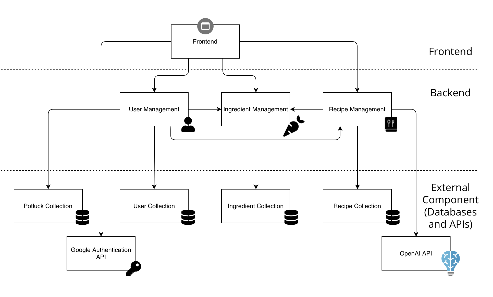

# M3 - Requirements and Design

## 1. Change History
Feb 24: 
- Revised the use case diagram in Section 3.1 by consolidating login and logout into a single authentication use case.
- Revised Section 3.5.1 to simplify the security approach by removing AES and RSA references, focusing on HTTPS and trusted libraries for robust protection without added complexity.
- Revised Section 3.5.2 to justify the four-click limit for user actions based on usability studies, emphasizing improved user satisfaction, task efficiency, and a user-friendly interface.
- Revised Section 4.5 to separate frontend, backend, and external component (Databases and APIs) using dotted lines.
- Revised Section 4.7.1 according to revision in Section 3.5.1.
- Revised Section 4.7.2 according to revision in Section 3.5.2.

Feb 28:
- Revised Section 3.2 "Authenticate" use case to align with the consolidation made in the use case diagram.
- Revised Section 3.5.3 to align with industry best practices by reducing the response time target from 10 seconds to 5 seconds, ensuring a more responsive user experience.
- Revised Sectiin 4.7.3 according to revision in Section 3.5.3.
- Revised Section 3.4 to reflect the updated user interface design with enhanced clarity and functionality.
- Revised Section 4.2 to align with the current MongoDB schema, incorporating Mongoose for schema validation, middleware-based lifecycle management, and automated referential integrity.

## 2. Project Description
Our app “IntelliDish - AI Powered Recipe Recommendations Taylored for your Stomach and Fridge” aims to solve challenges faced by people with busy schedules and limited access to diverse cooking ingredients. 

IntelliDish allows users to give a list of available ingredients to IntelliDish along with the type of cuisine they wish to cook (such as Chinese food, Italian food, etc.), and IntelliDish will return a number of recipes that are possible to create with the available ingredients. If no recipes can be made with the provided ingredients, IntelliDish will return recipes where ingredients are partially available and give suggestions to the users on additional ingredients to buy or possible ingredient replacements. Additionally, IntelliDish will also provide many useful features such as personalizing friend lists, personalizing favorite recipes, and participating in potluck (which allows multiple users to combine their available ingredients and search for recipes).

For users like busy university students and employees (who often lack the time, energy, cooking expertise, and recipe knowledge to plan meals), IntelliDish simplifies the meal preparation process by providing quick and desirable recipe suggestions using available ingredients. Additionally, for those with restricted ingredient options due to location or budget constraints, IntelliDish can maximize the value of available ingredients, allowing users to create desirable meals with limited access to diverse cooking ingredients.

<p align="center">
  
  
</p>

## 3. Requirements Specification
### **3.1. Use-Case Diagram**


### **3.2. Actors Description**
1. **User**  
   - The user provides the IntelliDish app with inputs such as available ingredients and cuisine preferences. The user can also manage their recipes and friends.  
   - For now, we have made the design choice that all users need to log in to use IntelliDish.  

2. **AI API**  
   - Provides possible recipes based on user input.  

3. **Authentication Service**  
   - Manages user login and logout.  

### **3.3. Functional Requirements**
<a name="fr1"></a>

**Overview**:
1. **Authenticate**
    * User logs into and out of IntelliDish using the authentication service to manage their session securely.
2. **Get Full Recipe Recommendation**
    * User provides a list of available ingredients and cuisine preferences, and the AI API returns a list of possible recipes.
3. **Get Partial Recipe Recommendation**
    * Suggest recipes where some ingredients are missing from user input, and provide possible substitutes for missing ingredients as well as possible recipes that doesn't match the user's cuisine preferences.
4. **Participate In PotLuck**
    * Users can collaboratively input available ingredients as a group for recipe recommendations.
5. **Manage Recipes**
    * Users can add or remove favorite recipes.
6. **Manage Friends**
    * Users can add or remove friends, with whom they can PotLuck and share recipes with.

**Detailed Flow for Each Independent Scenario**:

1. **Authenticate**
  - **Description**: User logs in to and logs out from IntelliDish using the authentication service to manage their session securely.
  - **Primary actor(s)**: User, Authentication Service.
  - **Main success scenario:**  
      - **1**. Upon opening the app, the user is on the login page. The user clicks "Sign In" and enters their credentials on the authentication service login page.  
      - **2**. The authentication service validates the user's credentials.  
      - **3**. The user successfully logs in to IntelliDish and starts using the system.  
      - **4**. When the user wants to log out, they select "Log Out" from the main page.  
      - **5**. The authentication service terminates the user's session.  
      - **6**. User session data (tokens, cookies, etc.) are cleared for security purposes.  
      - **7**. The user is redirected to the login screen after logging out.
  - **Failure scenario(s):**  
      - **1a**: Authentication service is unreachable/unavailable during login.
        - **1a1**: Display an error message that the authentication service is unreachable/unavailable.
        - **1a2**: Prompt the user to try again later or check online if the authentication service is down/under maintenance.  
      - **2a**: Authentication service determines that the user's credentials are invalid.
        - **2a1**: Display an error message that credentials are invalid.
        - **2a2**: Prompt the user to try again.
      - **4a**: Authentication service is unreachable/unavailable during logout, and session termination fails.
        - **4a1**: Display an error message that the authentication service is unreachable/unavailable.
        - **4a2**: Prompt the user to try again later or check online if the authentication service is down/under maintenance.

2. **Get Full Recipe Recommendation**:
    - **Description**: User provides a list of available ingredients and cuisine preferences, and the AI API returns a list of possible recipes.
    - **Primary actor(s)**: User, AI API.
    - **Main success scenario**:
        - **1**. The user provides a list of available ingredients and cuisine preferences to IntelliDish.
        - **2**. A request to the AI API is made based on the user's inputs.
        - **3**. The AI API returns a list of possible recipes to the user.
    - **Failure scenario(s)**:
        - **2a**: The AI API is unreachable/ unavailable.
            - **2a1**: Display error message that the AI API is unreachable/ unavailable.
            - **2a2**: Prompt the user to try again later, or check online whether the AI API is down/ under maintainence.
        - **2b**: No recipes are possible for the provided user inputs.
            - **2b1**: Suggest the user to use partial recipe recommendations, PotLuck with friends, or try again with different inputs instead.

3. **Get Partial Recipe Recommendation**:
    - **Description**: Suggest recipes where some ingredients are missing from user input, and provide possible substitutes for missing ingredients as well as possible recipes that doesn't match the user's cuisine preferences.
    - **Primary actor(s)**: User, AI API.
    - **Main success scenario**:
        - **1**. The user provides a list of available ingredients and cuisine preferences to IntelliDish.
        - **2**. A request to the AI API is made based on the user's inputs.
        - **3**. The AI API determines that there are no possible recipes based on the user's input.
        - **4**. The AI API suggests recipes where some ingredients are missing from user input, and provide possible substitutes for missing ingredients as well as possible recipes that doesn't match the user's cuisine preferences.
    - **Failure scenario(s)**:
        - **2a**: The AI API is unreachable/ unavailable.
            - **2a1**: Display error message that the AI API is unreachable/ unavailable.
            - **2a2**: Prompt the user to try again later, or check online whether the AI API is down/ under maintainence.
        - **2b**: No recipes are possible for the provided user inputs.
            - **2b1**: Suggest the user to use PotLuck with friends, or try again with different inputs instead.

4. **Participate In PotLuck**:
    - **Description**: Users can collaboratively input available ingredients as a group for recipe recommendations.
    - **Primary actor(s)**: User, AI API.
    - **Main success scenario**:
        - **1**. A user starts a PotLuck and invites his/ her friends to create a group.
        - **2**. The users collectively provide a list of available ingredients and cuisine preferences to IntelliDish. This could be done asynchronously, and users can continuous add and remove their ingredient contributions.
        - **3**. A request to the AI API is made based on the user's inputs.
        - **4**. The AI API returns a list of possible ingredients to the user.
    - **Failure scenario(s)**:
        - **1a**: Group creation failed.
            - **1a1**: Display error message that group creation failed as well as the reason behind the failure (PotLuck name conflicts with another existing Potluck, server is down, friend's account is deleted, etc), the prompt the user to try again.
        - **2a**: A user attempts to delete another user's contributions.
            - **2a1**: Display error message that users can only edit their own contributions.
        - **3a**: The AI API is unreachable/ unavailable.
            - **3a1**: Display error message that the AI API is unreachable/ unavailable.
            - **3a2**: Prompt the users to try again later, or check online whether the AI API is down/ under maintainence.
        - **3b**: No recipes are possible for the provided user inputs.
            - **3b1**: Suggest the users to use partial recipe recommendations, or try again with different inputs instead.

5. **Manage Favorite Recipes**:
    - **Description**: Users can add or remove favorite recipes.
    - **Primary actor(s)**: User.
    - **Main success scenario**:
        - **1**. The user selects a recipe from past queries to add to his/ her list of favorite recipes, or selects an existing recipe from his/ her list of favorite recipes to remove.
        - **2**. System asks the user for confirmation of action.
        - **3**. The user's list of favorite recipes is updated with the addition/ removal of a recipe.
    - **Failure scenario(s)**:
        - **1a**: The addition of a recipe fails due to issues with accessing past query data.
            - **1a1**: Display error message that the addition failed, and prompt the user to try again. Removal of recipes do not fail.
        - **1b**: The user attempts to add a duplicate recipe.
            - **1b1**: Display error message that the recipe is already in the user's favorite recipes list.

6. **Manage Friends**:
    - **Description**: Users can add or remove friends, with whom they can PotLuck and share recipes with.
    - **Primary actor(s)**: User.
    - **Main success scenario**:
        - **1**. The user enters the username of a user to add as a friend, or the user chooses a user from his/ her existing friend list to remove.
        - **2**. System asks the user for confirmation of action.
        - **3**. The user's friend list is updated with the addition/ removal of a friend.
    - **Failure scenario(s)**:
        - **1a**: The friend addition fails because the entered username is invalid/ cannot be found.
            - **1a1**: Display error message for the user to double check that the entered username for friend addition is correct, and prompt the user to try again. Removal of friends do not fail.
        - **1b**: The user attempts to add themselves as a friend.
            - **1b1**: Display error message that the user cannot add himself/ herself as a friend.

### **3.4. Screen Mockups**
These screen mockups illustrate the user interfaces for the Full Recipe Recommendation, Partial Recipe Recommendation, and Participate in PotLuck use cases.
- On the Recipe Recommendation page, users can manually add ingredients or upload a photo of their fridge. Once the ingredients are set, clicking the "Generate" button sends a request to the AI API, which processes and returns possible recipes.
- On the PotLuck page, users can browse, search for, join, or create potluck groups, enabling social meal planning and collaboration.

<p align="center">
  
  
</p>

### **3.5. Non-Functional Requirements**
<a name="nfr1"></a>

1. **Data Security**
    - **Description**: All user data—including login credentials, friend lists, query history, and saved recipes—should be securely transmitted using HTTPS to ensure data confidentiality during communication. Sensitive information is handled using trusted libraries and APIs that follow industry best practices for security. Additionally, user session data (e.g., tokens, cookies) should be managed securely and cleared upon user logout to prevent unauthorized access.
    - **Justification**: Using HTTPS ensures secure communication between the client and server, protecting data in transit. Relying on well-established libraries and security standards at the application and database levels helps safeguard sensitive information at rest. These measures enhance user privacy and build trust in IntelliDish when handling personal data such as login credentials, preferences, and location information.
2. **Usability/ Ease of Use**
    - **Description**: All user actions—such as inviting friends to PotLuck, adding or removing friends, and adding ingredients—should be completed in no more than four clicks. This limit is based on usability studies that indicate increased click numbers can lead to user frustration and decreased engagement. According to [this study](https://medium.com/@gizemkorpinar/impact-of-click-number-on-user-experience-fab78e1f2a91), keeping the number of clicks low improves user satisfaction and task efficiency.
    - **Justification**: IntelliDish aims to provide an intuitive, user-friendly interface with a low learning curve to attract and retain users of varying technological backgrounds. Limiting the number of clicks required for common actions helps streamline user workflows, reduce cognitive load, and enhance the overall user experience.

3. **Performance**
    - **Description**: 90% of user recipe queries should receive a response in less than 5 seconds. This accounts for worst-case scenarios such as heavy backend loads, API call failures, and/or extremely long or complex ingredient lists.
    - **Justification**: IntelliDish should aim to maintain fast response times to enhance user experience, increase retention, and sustain engagement. According to [this article](https://odown.com/blog/what-is-a-good-api-response-time/?utm_source=chatgpt.com#conclusion), users begin to perceive delays beyond 1 second, and response times exceeding 5 seconds are associated with increased frustration and potential abandonment. Industry best practices suggest that API response times between 2 to 5 seconds are tolerable for non-critical applications but should be optimized for user satisfaction.


## 4. Designs Specification
### **4.1. Main Components**
1. **User Management Component**
    - **Purpose**: Handles user authentication, registration, and profile management, including adding and removing friends. This ensures secure access to user-specific features and personal data.
    -  **Rationale**: Centralized handling of authentication and user data simplifies the app's backend structure and enables scalability. Alternatives like third-party services (e.g., Google OAuth) were considered but are unnecessary for initial implementation.
    - **Interfaces**: 
        1. `boolean login(String username, String password);`
            - **Purpose**: Validates user credentials and initiates a user session. Return true if login is successful; return false otherwise.
        2. `boolean register(String username, String password, String email);`
            - **Purpose**: Registers a new user. Return true if registration is successful, false otherwise.
        3. `boolean logout(String sessionId);`
            - **Purpose**: Ends a user session. Return true if log out successfully, false otherwise.
        4. `List<String> getFriends(String userId)`
           - **Purpose**: Fetches the user's friend list
        5. `boolean addFriend(String userId, String friendUsername);`
           - **Purpose**: Adds a friend to the user's friend list.
        6. `boolean removeFriend(String userId, String friendUsername);`
           - **Purpose**: Removes a friend from the user's friend list.
        
2. **Recipe Management Component**
   - **Purpose**: Manages communication with the AI API for generating recipes based on user-provided ingredients and preferences. It handles full and partial recipe recommendations, ensuring that missing ingredients are substituted appropriately.
   - **Rational**:  Centralizing recipe logic allows easy integration with external APIs and simplifies future enhancements, such as adding dietary filters.
   - **Interfaces**:
     1. `List<Recipe> getRecipes(List<String> ingredients, String cuisine);`
        - **Purpose**: Fetches recipes based on all provided ingredients and cuisine preference. Return a list of recipes
     2. `List<Recipe> getPartialRecipes(List<String> ingredients, String cuisine);`
        - **Purpose**: Suggests recipes even if some ingredients are missing, with substitutes. Return a list of recipes with substitution suggestions
     3. `boolean saveRecipe(Recipe recipe);`
        - **Purpose**: Saves a newly generated recipe to the database if it does not already exist, preventing duplicate entries and enabling recipe history tracking. Returns `true` if successful, `false` otherwise.
     4. `boolean removeRecipe(String recipeId);`
        - **Purpose**: Removes a saved recipe from the database based on the recipe ID. Returns `true` if successful, `false` otherwise.
    - **HTTP/REST Interfaces interact with OPENAI API**:
      1. `POST /recipes/generate`
         - **Purpose**: Generates recipes based on ingredients and cuisine preferences.
         - **Example Request**:
         ```
           {
              "ingredients": ["chicken", "rice", "carrots"],
              "cuisine": "Asian"
            }
         ```
         - **Example Response**:
         ```
         {
            "recipes": [
              {
                "name": "Chicken Stir-Fry",
                "ingredients": ["chicken", "rice", "carrots"],
                "instructions": "Cook chicken, then stir-fry with rice and carrots."
              },
              {
                "name": "Vegetable Fried Rice",
                "ingredients": ["rice", "carrots"],
                "instructions": "Fry rice with chopped carrots."
              }
            ]
          }
          ```
      2. `POST /ingredients/suggest-substitution`
         - **Purpose**: Suggests recipes with partially available ingredients, along with guidance on missing ingredients and their replacements.
         - **Example Request**:
         ```
          {
            "ingredients": ["chicken"],
            "cuisine": "Italian"
          }
         ```
         - **Example Response**:
         ```
          {
            "partialRecipes": [
              {
                "name": "Chicken Salad",
                "availableIngredients": ["chicken"],
                "missingIngredients": ["lettuce", "tomatoes"],
                "instructions": "Mix chicken with chopped vegetables for a quick salad."
              }
            ],
            "suggestions": {
              "ingredientsToBuy": ["pasta", "cream", "lettuce", "tomatoes"],
              "substitutions": {
                "cream": "Greek yogurt",
                "lettuce": "spinach"
              }
            }
          }
          ```
3. **Ingredient Management Component**
   - **Purpose**: Manages user-provided ingredients, including adding, removing, and editing ingredients for both individual and collaborative use cases.
   - **Rational**: A dedicated component ensures clear separation of ingredient management logic, which simplifies extending functionality, such as handling alternate ingredient suggestions.
   - **Interfaces**:
     1. `boolean addIngredient(String userId, String ingredient);`
           - **Purpose**: Adds an ingredient to the user's personal ingredient list.
     2. `boolean removeIngredient(String userId, String ingredient);`
           - **Purpose**: Removes an ingredient from the user's personal ingredient list.
     3. `boolean addGroupIngredient(String groupId, String userId, String ingredient);`
           - **Purpose**: Adds an ingredient to a PotLuck group.
     4. `boolean removeGroupIngredient(String groupId, String userId, String ingredient);`
           - **Purpose**: Removes an ingredient added by the user to a PotLuck group.
4. **PotLuck Collaboration Component**
   - **Purpose**: Allows multiple users to collaborate by pooling their ingredients and generating group-specific recipe recommendations. Ensures user contributions are tracked and managed efficiently.
   - **Rational**: Isolating collaboration logic as a separate component improves modularity.
   - **Interfaces**:
     1. `boolean createPotluck(String groupName, String ownerId);`
        - **Purpose**: Creates a new PotLuck group. Return true if the group is successfully created, false otherwise.
     2. `boolean addMember(String groupId, String newUserId);`
        - **Purpose**: Adds a member to an existing PotLuck group.
     3. `boolean removeMember(String groupId, String userId);`
        - **Purpose**: Removes a member from the PotLuck group.
     4. `List<String> listGroupIngredients(String groupId);`
        - **Purpose**: Fetches the list of all ingredients contributed by group members. Return a list of ingredients.

### **4.2. Databases**
1. **MongoDB Database**
    - **Purpose**: Stores user data, including credentials, preferences, friend lists, recipes, ingredient lists, and potluck information. The database enables seamless integration with TypeScript through Mongoose, ensuring type safety, schema validation, and middleware-based lifecycle management while handling dynamic and unstructured data efficiently.
    -  **Rationale**: MongoDB’s document-based schema offers flexibility for handling hierarchical and unstructured data, such as recipes and ingredient metadata. By leveraging Mongoose, the schema ensures robust validation, optimized queries, and seamless updates when user-related documents are deleted or modified. Mongoose middleware functions facilitate automated referential integrity, such as removing references to deleted users, recipes, or ingredients, ensuring data consistency across collections.
    ##### **Database Collections**

    ##### **Users (`/users`)**
    ```
    [
        {
            "_id": ObjectId,
            "email": String,
            "name": String,
            "friends": [ObjectId],
            "recipes": [ObjectId],
            "ingredients": [ObjectId],
            "potluck": [ObjectId]
        }
    ]
    ```

    ##### **Recipes (`/recipes`)**
    ```
    [
        {
            "_id": ObjectId,
            "name": String,
            "ingredients": [String],
            "procedure": [String],
            "cuisineType": String,
            "recipeComplexity": "Don't Care" | "Very Easy" | "Easy" | "Medium" | "Hard" | "Very Hard",
            "preparationTime": Number, // Time in minutes
            "calories": Number, // Total calories per serving
            "price": Number
        }
    ]
    ```

    ##### **Ingredients (`/ingredients`)**
    ```
    [
        {
            "_id": ObjectId,
            "name": String,
            "category": "Vegetables" | "Fruit" | "Whole Grains" | "Meats" | "Eggs" | "Dairy" | "Condiments" | "Others",
            "quantity": Number,
            "unit": "g" | "kg" | "ml" | "l" | "tsp" | "tbsp" | "cup" | "pcs"
        }
    ]
    ```

    ##### **Potluck (`/potluck`)**
    ```
    [
        {
            "_id": ObjectId,
            "name": String,
            "date": Date,
            "host": ObjectId,
            "participants": [{ "user": ObjectId, "ingredients": [String] }],
            "ingredients": [String],
            "recipes": [ObjectId]
        }
    ]
    ```

### **4.3. External Modules**
1. **OPENAI API** 
    - **Purpose**: Processes user-provided inputs such as ingredients and cuisine preferences to generate personalized recipe suggestions using advanced NLP.
    - **Rational**: OpenAI’s powerful GPT-based models provide high-quality, context-aware recommendations, enabling features like partial recipe suggestions and ingredient substitutions.
2. **Google Authentication**
   - **Purpose**: Manages secure user login using Google accounts for authentication.
   - **Rational**: Google Authentication is widely trusted, simplifies user onboarding, and reduces the need to manage passwords manually. The Google sign-in Process can be directly handled using native libraries in frontend implementation.

### **4.4. Frameworks**
1. **Frontend Framework: Kotlin (Android)**
    - **Purpose**: Develop a native Android application to deliver an optimized, responsive, and user-friendly interface for mobile users.
    - **Reason**: Kotlin is the standard for Android development, offering seamless integration with Android SDK and native performance.
3. **Backend Framework: Node.js (TypeScript)**
   - **Purpose**: Implements the server-side logic to handle API requests, manage the database, and integrate external services like OpenAI.
    - **Reason**: Node.js with TypeScript ensures scalability, maintainability, and type safety.
4. **Cloud Service: AWS**
   - **Purpose**: Hosts the backend (Node.js)
   - **Reason**: AWS offers robust free-tier options, scalability, and integration flexibility for deploying and managing EC2 instances. It complies with the project constraints and ensures reliability and availability.

### **4.5. Dependencies Diagram**


### **4.6. Functional Requirements Sequence Diagram**
1. [**Log In**](#fr1)\

2. [**Log Out**](#fr1)\

3. [**Get Full Recipe Recommendation**](#fr1)\

4. [**Get Partial Recipe Recommendation**](#fr1)\

5. [**Participate In PotLuck**](#fr1)\

6. [**Manage Recipes**](#fr1)\

7. [**Manage Friends**](#fr1)\


### **4.7. Non-Functional Requirements Design**
1. [**Data Security**](#nfr1)
    - **Validation**: Use Transport Layer Security (TLS) (via HTTPS) to secure user data in transit. Verify the implementation through penetration testing and static code analysis to ensure compliance with security standards and best practices. Trusted libraries and APIs should be used for secure data handling at the application and database levels.
2. [**Usability/Ease of Use**](#nfr1)
    - **Validation**: Conduct usability tests with diverse user groups to ensure that key actions—such as recipe searching or PotLuck creation—can be completed in no more than four clicks, aligning with usability research on optimal interaction limits. Implement contextual tooltips and real-time error handling to guide users and enhance overall ease of use and task efficiency.
3. [**Performance**](nfr1)
    - **Validation**: Use stress testing tools like JMeter or Locust to simulate real-world usage scenarios. Optimize performance by implementing caching, query tuning, and load balancing to ensure 90% of API requests complete within 5 seconds under expected loads.


### **4.8. Main Project Complexity Design - Recipe Ranking Algorithm**
**Description:**

When the user requests recipe recommendations, they will have the option to adjust a series of slide bars corresponding to key attributes of a recipe:
  - Preparation time
  - Recipe complexity
  - Nutritional value
  - Number of calories
  - Spice level
  - Price
  - Cuisine type (optional filtering criterion)

Each slide bar allows the user to select a value from 1 to 10, or choose “don’t care”, which means the attribute will not be considered in the ranking process. For example, a busy student or employee might input:
  - Preparation time = 3/10 (prefers quick recipes)
  - Recipe complexity = 3/10 (wants easy recipes)
  - Nutritional value = "don't care"
  - Number of calories = "don't care"
  - Spice level = "don't care"

This means the ranking will prioritize fast and easy recipes while ignoring the other attributes.

Each recipe returned by the AI API will come with corresponding metadata ratings. Examples:

Beef Wellington
  - Preparation time: 9/10 (Time-intensive, multiple steps)
  - Recipe complexity: 10/10 (Very complex, requires precise technique)
  - Nutritional value: 6/10 (High protein but also high saturated fat)
  - Number of calories: 8/10 (High due to puff pastry and butter)
  - Spice level: 2/10 (Mild, seasoned with salt, pepper, and mustard)
  - Price: 9/10 (Expensive, premium ingredients)
  - Cuisine type: French

Caesar Salad
  - Preparation time: 3/10 (Quick to prepare)
  - Recipe complexity: 3/10 (Simple, but making dressing from scratch requires emulsification)
  - Nutritional value: 7/10 (Healthy fats, protein, fiber, but can be high in sodium)
  - Number of calories: 5/10 (Moderate, varies with dressing and toppings)
  - Spice level: 2/10 (Mild, seasoned with garlic, lemon, and anchovies)
  - Price: 3/10 (Inexpensive, common ingredients)
  - Cuisine type: Italian

**Why complex?:**
1. Adaptive Multi-Attribute Optimization
  - The system must dynamically adjust rankings based on multiple user-defined attributes.
  - Each user may prioritize different aspects (e.g., one may focus on nutritional value, while another may care more about speed and simplicity).
2. Handling “Don’t Care” Inputs
  - If a user selects “don’t care” for an attribute, it should be excluded from ranking calculations.
  - The ranking algorithm must adapt dynamically based on which attributes are relevant.
3. Choosing the Best Ranking Algorithm
  - The system must determine which ranking approach to use based on:
  - The number of recipes being ranked.
  - The trade-off between accuracy and computational efficiency.
  - The distribution of user preferences, as different weight distributions can impact ranking behavior.

**Design**:

Input:
1. User Preferences (from Slide Bars):
  - Preparation time (1-10, or "don't care")
  - Recipe complexity (1-10, or "don't care")
  - Nutritional value (1-10, or "don't care")
  - Number of calories (1-10, or "don't care")
  - Spice level (1-10, or "don't care")
  - Price (1-10, or "don't care")
  - Cuisine type (optional filtering criterion)
2. List of Recipes Returned by AI API:
  - Recipe name
  - Metadata attributes (Preparation time, Recipe complexity, Nutritional value, Calories, Spice level, Price, Cuisine type)

Output:
  - A ranked list of recipes, sorted based on user preferences.

**Main computational logic**:

1. Weight Assignment:
  - Convert user preferences into weights for each attribute.
  - Normalize weights so that only selected attributes contribute to ranking.
2. Exclude "Don't Care" Attributes:
  - Ignore attributes that the user marked as “don’t care” in ranking calculations.
3. Compute Recipe Scores:
  - Use a weighted similarity function to compare each recipe’s metadata against user preferences.
  - The function should prioritize matches while allowing some flexibility.
4. Sort Recipes by Score:
  - Rank recipes in descending order based on their computed similarity scores.

**Pseudo-code**:

```
FUNCTION rank_recipes(user_preferences, recipe_list)
    // Step 1: Assign Weights Based on User Preferences
    weights ← Normalize user preferences so that important attributes have more influence

    ranked_recipes ← Empty list

    // Step 2: Calculate Score for Each Recipe
    FOR each recipe IN recipe_list DO
        score ← 0
        total_weight ← 0

        // Step 3: Evaluate Each Attribute
        FOR each attribute IN recipe.metadata DO
            user_value ← user_preferences[attribute]

            IF user_value is NOT "don't care" THEN
                attribute_weight ← weights[attribute]
                
                // Calculate how well the recipe matches the user’s preference
                match_score ← (10 - ABS(recipe.metadata[attribute] - user_value)) * attribute_weight
                
                score ← score + match_score
                total_weight ← total_weight + attribute_weight

        // Normalize score if applicable
        IF total_weight > 0 THEN
            score ← score / total_weight

        // Store the recipe and its final score
        ADD (recipe.name, score) TO ranked_recipes

    // Step 4: Sort Recipes by Score (Descending Order)
    SORT ranked_recipes BY score IN descending order

    // Step 5: Return the Ranked List
    RETURN ranked_recipes
```

**Additional Considerations**

1. Cuisine Type Filtering: If the user selects a specific cuisine type, recipes outside of that cuisine should be filtered out before ranking.
2. Real-Time UI Updates: The system should instantly re-rank recipes when users adjust sliders, ensuring a seamless experience.

## 5. Contributions
**TLDR**: Work was distributed evenly among team members, and all members are satisfied.
- Allison Jiao
    - section 2
    - section 3.2
    - section 3.4
    - section 3.5
    - section 4.2
- Edward Han
    - section 2
    - section 3.1
    - section 3.2
    - section 3.3
    - section 4.8

- Angela Gao
    - section 4.1
    - section 4.5
    - section 4.6
    - section 4.7 
    - section 4.8

- Yixi Lu
    - section 4.1
    - section 4.2
    - section 4.3
    - section 4.4
    - section 4.6
