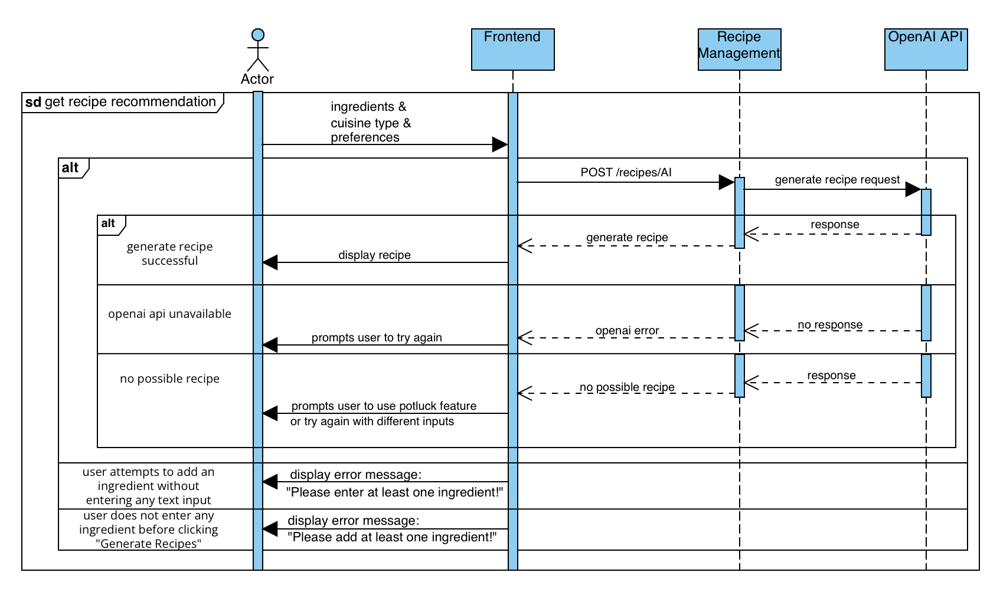
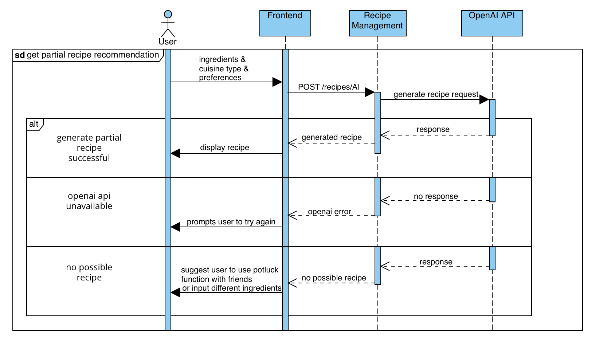
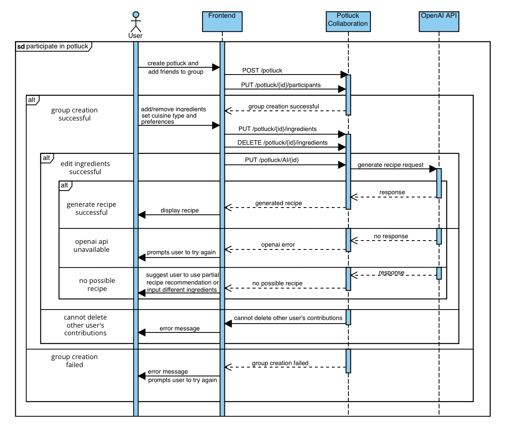
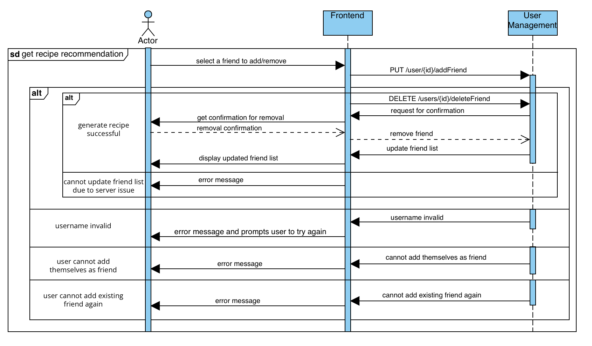

# M3 - Requirements and Design

## 1. Change History
Feb 24: 
- Revised the use case diagram in Section 3.1 by consolidating login and logout into a single authentication use case.
- Revised Section 3.5.1 to simplify the security approach by removing AES and RSA references, focusing on HTTPS and trusted libraries for robust protection without added complexity.
- Revised Section 3.5.2 to justify the four-click limit for user actions based on usability studies, emphasizing improved user satisfaction, task efficiency, and a user-friendly interface.
- Revised Section 4.5 to separate frontend, backend, and external component (Databases and APIs) using dotted lines.
- Revised Section 4.7.1 according to revision in Section 3.5.1.
- Revised Section 4.7.2 according to revision in Section 3.5.2.

Feb 27:
- Revised Section 3.2 "Authenticate" use case to align with the consolidation made in the use case diagram.
- Revised Section 3.5.3 to align with industry best practices by reducing the response time target from 10 seconds to 5 seconds, ensuring a more responsive user experience.
- Revised Sectiin 4.7.3 according to revision in Section 3.5.3.
- Revised Section 3.4 to reflect the updated user interface design with enhanced clarity and functionality.
- Revised Section 4.2 to align with the current MongoDB schema, incorporating Mongoose for schema validation, middleware-based lifecycle management, and automated referential integrity.
- Revised Section 4.4 to include Firebase Cloud Messaging (FCM) for real-time notifications and live updates, enhancing user engagement and responsiveness.
- Revised Section 3.3 "Participate in PotLuck" use case to clarify the flow, incorporating group creation, invitations, and real-time updates.

Feb 28:
- Revised Section 4.1 to provide clearer rationale for separating the main components and updated each interface to align with the latest implementation details.
- Revised Section 4.5 to capture the updated interactions between components.
- Revised Section 4.6 to more clearly illustrate the flow of each use case.

Mar 1:
- Revised Section 4.8 to replace the original main complexity idea with a Levenshtein Distance approach for fuzzy user input matching, ensuring more robust text input searches and enhanced user experience.

Mar 9:
- Revised Section 3.3 to clarify the flow of "Get Full Recipe Recommendation" and "Get Partial Recipe Recommendation" for E2E testing purposes.

Mar 10:
- Revised Section 3.3 to clarify the flow of "Manage Friends" for E2E testing purposes.

Mar 12:
- Revised Section 3.3 to clarify the flow of "Participate In PotLuck" for E2E testing purposes.

Mar 13:
- Revised Section 3.5 to more clearly introduce the non-functional requirements of data security and performance.
- Revised Section 4.7 to change the non-functional requirements design for data security and performance.

Mar 19:
- Revised Section 4.5 to capture the updated interactions between components.

Mar 28:
- Revised Section 3.3 to align with the current implementation.

## 2. Project Description
Our app “IntelliDish - AI Powered Recipe Recommendations Taylored for your Stomach and Fridge” aims to solve challenges faced by people with busy schedules and limited access to diverse cooking ingredients. 

IntelliDish allows users to give a list of available ingredients to IntelliDish along with the type of cuisine they wish to cook (such as Chinese food, Italian food, etc.), and IntelliDish will return a number of recipes that are possible to create with the available ingredients. If no recipes can be made with the provided ingredients, IntelliDish will return recipes where ingredients are partially available and give suggestions to the users on additional ingredients to buy or possible ingredient replacements. Additionally, IntelliDish will also provide many useful features such as personalizing friend lists, personalizing favorite recipes, and participating in potluck (which allows multiple users to combine their available ingredients and search for recipes).

For users like busy university students and employees (who often lack the time, energy, cooking expertise, and recipe knowledge to plan meals), IntelliDish simplifies the meal preparation process by providing quick and desirable recipe suggestions using available ingredients. Additionally, for those with restricted ingredient options due to location or budget constraints, IntelliDish can maximize the value of available ingredients, allowing users to create desirable meals with limited access to diverse cooking ingredients.

<p align="center">
  
  
</p>

## 3. Requirements Specification
### **3.1. Use-Case Diagram**


### **3.2. Actors Description**
1. **User**  
   - The user provides the IntelliDish app with inputs such as available ingredients and cuisine preferences. The user can also manage their recipes and friends.  
   - For now, we have made the design choice that all users need to log in to use IntelliDish.  

2. **AI API**  
   - Provides possible recipes based on user input.  

3. **Authentication Service**  
   - Manages user login and logout.  

### **3.3. Functional Requirements**
<a name="fr1"></a>

**Overview**:
1. **Authenticate**
    * User logs into and out of IntelliDish using the authentication service to manage their session securely.
2. **Get Recipe Recommendation**
    * User provides a list of available ingredients and cuisine preferences, and the AI API returns a possible recipe.
3. **Participate In PotLuck**
    * Users can collaboratively input available ingredients as a group for recipe recommendations.
4. **Manage Recipes**
    * Users can add or remove recipes.
5. **Manage Friends**
    * Users can add or remove friends, with whom they can PotLuck and share recipes with.

**Detailed Flow for Each Independent Scenario**:

1. **Authenticate**
    - **Description**: User logs in to and logs out from IntelliDish using the authentication service to manage their session securely.
    - **Primary actor(s)**: User, Authentication Service.
    - **Main success scenario:**  
        - **1**. Upon opening the app, the user is on the login page. The user clicks "Sign In" and enters their credentials on the authentication service login page.  
        - **2**. The authentication service validates the user's credentials.  
        - **3**. The user successfully logs in to IntelliDish and starts using the system.  
        - **4**. When the user wants to log out, they select "Log Out" from the main page.  
        - **5**. The authentication service terminates the user's session.  
        - **6**. User session data (tokens, cookies, etc.) are cleared for security purposes.  
        - **7**. The user is redirected to the login screen after logging out.
    - **Failure scenario(s):**  
        - **1a**. Authentication service is unreachable/unavailable during login.
          - **1a1**. Display an error message that the authentication service is unreachable/unavailable.
          - **1a2**. Prompt the user to try again later or check online if the authentication service is down/under maintenance.  
        - **2a**. Authentication service determines that the user's credentials are invalid.
          - **2a1**. Display an error message that credentials are invalid.
          - **2a2**. Prompt the user to try again.
        - **4a**. Authentication service is unreachable/unavailable during logout, and session termination fails.
          - **4a1**. Display an error message that the authentication service is unreachable/unavailable.
          - **4a2**. Prompt the user to try again later or check online if the authentication service is down/under maintenance.

2. **Get Recipe Recommendation**:
    - **Description**: User provides a list of available ingredients and cuisine preferences, and the AI API returns a possible recipe.
    - **Primary actor(s)**: User, AI API.
    - **Main success scenario**:
        - **1**. The user clicks the "Get Recommendation" button on the main page to access the "Get Recipe Recommendation" feature.
        - **2**. The app displays the following UI components:
          - Text Field labeled “Enter ingredients”
          - Add Ingredient (button)
          - Upload Image (button)
          - View Image (button)
          - Ingredient List Display (large rectangular container for added ingredients)
          - Clear Ingredients (button)
          - Cuisine Type (button)
          - Preferences (button)
          - Reset Cuisine Type and Preferences (button)
          - Allow Partial Recipe Recommendations (toggle switch)
          - Generate Recipes (button)
        - **3**. The user enters a list of available ingredients and selects cuisine preferences.
        - **4**. The app sends a request to the AI API with the provided inputs.
        - **5**. The AI API returns a possible recipe to the user.
    - **Failure scenario(s)**:
        - **3a**. The user attempts to add an ingredient without entering any text input.
            - **3a1**: Display an error message: “Please enter at least one ingredient!”
        - **3b**. The user does not enter any ingredient before clicking "Generate Recipes".
            - **3b1**. Display an error message: “Please add at least one ingredient!”
        - **5a**. The AI API is unreachable/ unavailable.
            - **5a1**. Display error message that the AI API is unreachable/ unavailable.
            - **5a2**. Prompt the user to try again later, or check online whether the AI API is down/ under maintainence.
        - **5b**. No recipes are possible for the provided user inputs.
            - **5b1**. Suggest the user to use PotLuck with friends or try again with different inputs instead.

3. **Participate In PotLuck**:
    - **Description**: Users collaboratively contribute available ingredients for group-based recipe recommendations while managing group creation, invitations, and participant interactions.
    - **Primary actor(s)**: User, AI API.
    - **Main success scenario**:
        - **1**. The user clicks the "PotLuck" button on the main page to access the "Participate In PotLuck" feature.
        - **2**. The app displays the following UI components:
            - ALL JOINED POTLUCK (button)
            - CREATE NEW POTLUCK (button)
            - Text Field labeled "Search for PotLucks"
            - JOIN SELECTED POTLUCK (button)
            - Existing PotLucks Display (large rectangular container for existing potlucks)
        - **3**. The user starts a PotLuck and adds their friends to create a group.
        - **4**. Each user independently adds or removes their ingredient contributions and sets cuisine type and preferences within the PotLuck group. Live updates ensure real-time synchronization across all participants.
        - **5**. A request is sent to the AI API based on the combined user inputs.
        - **6**. The AI API returns a list of possible recipes based on the collective ingredients.
    - **Failure scenario(s)**:
        - **3a**. The user clicks "CREATE POTLUCK" without entering a potluck name.
            - **3a1**. Display an error message: “Please enter a potluck name!”
        - **4a**. A user attempts to delete another user’s contributions.
            - **4a1**. Display an error message stating that users can only modify their own contributions.
        - **6a**. The AI API is unreachable/unavailable.
            - **6a1**. Display an error message that the AI API is unreachable/unavailable.
            - **6a2**. Prompt the users to try again later or check online whether the AI API is down/under maintenance.

4. **Manage Recipes**:
    - **Description**: Users can add or remove recipes.
    - **Primary actor(s)**: User.
    - **Main success scenario**:
        - **1**. The user selects a recipe from past queries to add to their list of saved recipes, or selects an existing recipe from their list of saved recipes to remove.
        - **2**. System asks the user for confirmation of recipe removal.
        - **3**. The user's list of saved recipes is updated with the addition/ removal of a recipe.
    - **Failure scenario(s)**:
        - **1a**. The addition of a recipe fails due to issues with accessing past query data.
            - **1a1**. Display error message that the addition failed, and prompt the user to try again. Removal of recipes do not fail.
        - **1b**. The user attempts to add a duplicate recipe.
            - **1b1**. Display error message that the recipe is already in the user's saved recipes list.

5. **Manage Friends**:
    - **Description**: Users can add or remove friends, with whom they can PotLuck with.
    - **Primary actor(s)**: User.
    - **Main success scenario**:
        - **1**. The user clicks the "Manage Friends" button on the main page to access the "Manage Friends" feature.
        - **2**. The app displays the following UI components:
          - Text Field for friend search by email.
          - Add Friend (button)
          - Friend List, or text saying there are currently no friends.
        - **3**. The user enters the username of a user to add as a friend, or the user chooses a user from his/ her existing friend list to remove.
        - **4**. System asks the user for confirmation of friend removal.
        - **5**. The user's friend list is updated with the addition/ removal of a friend.
    - **Failure scenario(s)**:
        - **3a**. The friend addition fails because the entered username is invalid/ cannot be found.
            - **3a1**. Display error message for the user to double check that the entered username for friend addition is correct, and prompt the user to try again. Removal of friends do not fail.
        - **3b**. The user attempts to add themselves as a friend.
            - **3b1**. Display error message that the user cannot add himself/ herself as a friend.
        - **3c**. The user attempts to add an existing friend as a friend again.
            - **3c1**. Display error message that the user is already friends with the existing friend.
        - **5a**. The user's friend list cannot be updated due to server issues.
            - **5a1**. Display error message that there are backend server issues.

### **3.4. Screen Mockups**
These screen mockups illustrate the user interfaces for the Full Recipe Recommendation, Partial Recipe Recommendation, and Participate in PotLuck use cases.
- On the Recipe Recommendation page, users can manually add ingredients or upload a photo of their fridge. Once the ingredients are set, clicking the "Generate" button sends a request to the AI API, which processes and returns possible recipes.
- On the PotLuck page, users can browse, search for, join, or create potluck groups, enabling social meal planning and collaboration.

<p align="center">
  
  
</p>

### **3.5. Non-Functional Requirements**
<a name="nfr1"></a>

1. **Data Security**
    - **Description**: All user data—including login credentials, friend lists, and saved recipes—must be handled in a manner that prevents leakage of sensitive fields (such as passwords, tokens, or private notes) in server responses. Our production environment enforces HTTPS for all transmissions, ensuring that data in transit remains encrypted. Additionally, user session data (e.g., tokens, cookies) is managed securely and invalidated upon logout to prevent unauthorized reuse.
    - **Justification**: By strictly filtering out sensitive fields before sending JSON responses, IntelliDish mitigates the risk of accidentally exposing user credentials or private details. Serving all traffic via HTTPS further secures data in transit from eavesdropping or tampering. These measures follow recognized industry best practices and help establish user trust in how IntelliDish handles personal information.
2. **Usability/ Ease of Use**
    - **Description**: All user actions—such as inviting friends to PotLuck, adding or removing friends, and adding ingredients—should be completed in no more than four clicks. This limit is based on usability studies that indicate increased click numbers can lead to user frustration and decreased engagement. According to [this study](https://medium.com/@gizemkorpinar/impact-of-click-number-on-user-experience-fab78e1f2a91), keeping the number of clicks low improves user satisfaction and task efficiency.
    - **Justification**: IntelliDish aims to provide an intuitive, user-friendly interface with a low learning curve to attract and retain users of varying technological backgrounds. Limiting the number of clicks required for common actions helps streamline user workflows, reduce cognitive load, and enhance the overall user experience.

3. **Performance**
    - **Description**: 90% of user recipe queries should receive a response in less than 10 seconds for AI recipe generation. This accounts for worst-case scenarios such as heavy backend loads, API call failures, and/or extremely long or complex ingredient lists.
    - **Justification**: IntelliDish should aim to maintain fast response times to enhance user experience, increase retention, and sustain engagement. According to [this article](https://odown.com/blog/what-is-a-good-api-response-time/?utm_source=chatgpt.com#conclusion), users begin to perceive delays beyond 1 second, and response times exceeding 5 seconds are associated with increased frustration and potential abandonment. Industry best practices generally recommend 2–5 second targets for non-critical applications, but the added complexity of AI recipe generation—plus occasional worst-case conditions—makes a 10-second upper bound a pragmatic performance requirement.


## 4. Designs Specification
### **4.1. Main Components**
1. **User Management Component**
    - **Purpose**: Manages the creation, retrieval, updating, and deletion of users. It also handles friend relationships (adding/removing friends) and manages user-associated recipes and ingredients.
    - **Rationale**: Centralizing these operations simplifies maintenance, security, and scaling. It also streamlines integration with external authentication (like Google OAuth) and facilitates future expansion of user-related features.
    - **Interfaces**: 
        1. `List<User> getUsers();`
            - **Purpose**: Fetches a list of all users.
        2. `User getUserById(String userId);`
            - **Purpose**: Retrieves a single user based on their MongoDB ObjectId.
        3. `User getUserByEmail(String email);`
            - **Purpose**: Retrieves a single user using their email address.
        4. `String createNewUser(User userData);`
           - **Purpose**: Creates a new user record in the database. Returns the user’s newly assigned ID on success.
        5. `boolean updateUserName(String userId, String newName);`
           - **Purpose**: Updates a user's name if the user exists.
        6. `boolean deleteUserAccount(String userId);`
           - **Purpose**: Removes a user record from the database.
        7. `boolean addNewFriend(String userId, String friendId);`
            - **Purpose**: Establishes a mutual friend relationship between two users.
        8. `boolean deleteFriend(String userId, String friendId);`
            - **Purpose**: Removes an existing friend relationship between two users.
        9. `List<User> getFriends(String userId);`
            - **Purpose**: Returns a list of the user’s friends with optional friend detail (e.g., name, email).
        10. `boolean addRecipeToUser(String userId, String recipeId);`
            - **Purpose**: Associates an existing recipe with a user, storing only the recipe ID in the user’s recipes list.
        11. `boolean deleteRecipeFromUser(String userId, String recipeId);`
            - **Purpose**: Removes a recipe reference from a user’s saved recipes.
        12. `List<Recipe> getRecipes(String userId);`
            - **Purpose**: Retrieves the user’s associated recipes (populated from recipe IDs).
        13. `boolean addIngredientToUser(String userId, String ingredientId);`
            - **Purpose**: Adds a reference to an existing ingredient to the user’s ingredients list.
        14. `boolean deleteIngredientFromUser(String userId, String ingredientId);`
            - **Purpose**: Removes the given ingredient from the user’s ingredients list.
        15. `List<Ingredient> getIngredients(String userId);`
            - **Purpose**: Fetches all ingredients associated with a user.
   - **HTTP/REST Interfaces**:
     - GET /users – Retrieves all users.
     - POST /users – Creates a new user.
     - GET /users/id/{id} – Retrieves a user by ID.
     - PUT /users/{id}/name – Updates a user’s name.
     - PUT /users/{id}/addFriend – Adds a friend to a user’s list.
     - PUT /users/{id}/deleteFriend – Removes a friend from a user’s list.
     - GET /users/{id}/friends – Fetches a user’s friends.
     - DELETE /users/{id} – Deletes a user.
     - POST /users/{id}/recipe – Adds a recipe to the user’s saved list.
     - DELETE /users/{id}/recipe – Removes a recipe from a user’s saved list.
     - GET /users/{id}/recipes – Retrieves a user’s saved recipes.
     - POST /users/{id}/ingredient – Adds an ingredient to a user’s list.
     - DELETE /users/{id}/ingredient – Removes an ingredient from a user’s list.
     - GET /users/{id}/ingredients – Retrieves a user’s ingredients.
        
2. **Recipe Management Component**
   - **Purpose**: Manages the creation, retrieval, updating, and deletion of recipe records. It can also generate new recipes via AI (recipesGeneration), and fetch ingredient details associated with a given recipe.
   - **Rationale**:  Centralizing recipe operations simplifies the system architecture. By isolating all recipe-related functions, it becomes straightforward to add features like advanced recipe filtering, integration with external APIs, or extended AI capabilities.
   - **Interfaces**:
     1. `List<Recipe> getAllRecipes();`
        - **Purpose**: Fetches a list of all recipes from the database.
     2. `Recipe getRecipeById(String recipeId);`
        - **Purpose**: Retrieves a single recipe based on its MongoDB ObjectId.
     3. `List<Recipe> getRecipeByName(String recipeName);`
        - **Purpose**: Performs a case-insensitive search for recipes matching the specified name.
     4. `List<Ingredient> getIngredientsFromRecipeId(String recipeId);`
        - **Purpose**: Looks up all ingredient records corresponding to the names listed in a recipe.
     5. `String postNewRecipe(Recipe recipeData);`
        - **Purpose**: Creates a new recipe in the database. Returns the assigned ID upon successful creation.
     6. `List<Recipe> postNewRecipeFromAI(List<String> ingredients);`
        - **Purpose**: Uses an AI helper (recipesGeneration) to generate recipes from the supplied ingredients. Inserts any new recipes into the database.
     7. `boolean putRecipeById(String recipeId, Recipe updateData);`
        - **Purpose**: Updates an existing recipe by its ID, modifying fields such as name, ingredients, or instructions.
     8. `boolean deleteRecipeById(String recipeId);`
        - **Purpose**: Deletes an existing recipe record from the database.
    - **HTTP/REST Interfaces**:
      - GET /recipes - Retrieves all recipes in the database.
      - POST /recipes - Creates a new recipe record.
      - GET /recipes/id/{id} - Retrieves a single recipe by its ID.
      - GET /recipes/name?name={recipeName} - Retrieves all recipes matching a specific name (case-insensitive).
      - GET /recipes/{id}/getIngredientDetails - Returns all matching ingredient documents for a recipe’s ingredient names.
      - POST /recipes/AI - Generates recipes using AI from a list of ingredients, then inserts them into the database.
      - PUT /recipes/{_id} - Updates an existing recipe by ID.
      - DELETE /recipes/{_id} - Deletes a recipe by its ID.

3. **Ingredient Management Component**
   - **Purpose**: Manages the creation, retrieval, updating, and deletion of ingredient records in the database. It also handles AI-based ingredient recognition (ingredientsRecognition) and merges or splits ingredient entries based on name, unit, and quantity.
   - **Rationale**: A dedicated ingredient component provides a clear and scalable way to handle diverse ingredient operations. This includes:
     - Centralized “add or update” logic (creating a new ingredient if one does not exist, or updating quantity if it does).
     - Unit conversion for ingredients (e.g., grams to kilograms, mL to L).
     - AI-driven image processing to detect and parse ingredients from uploaded images.
   - **Interfaces**:
      1. `List<Ingredient> getAllIngredients();`
           - **Purpose**: Fetches a list of all ingredients from the database.
      2. `Ingredient getIngredientById(String ingredientId);`
           - **Purpose**: Retrieves a single ingredient based on its MongoDB ObjectId.
      3. `List<Ingredient> getIngredientByName(String name);`
           - **Purpose**: Retrieves all ingredients that match a given name (case-insensitive).
      4. `Ingredient postNewIngredient(Ingredient ingredientData);`
           - **Purpose**: Creates a new ingredient record or merges quantity with an existing ingredient if a matching name/unit is found.
      5. `boolean putIngredientById(String ingredientId, Ingredient updateData);`
           - **Purpose**: Updates an existing ingredient’s fields (e.g., quantity, category) based on the provided ID.
      6. `boolean deleteIngredientById(String ingredientId);`
           - **Purpose**: Removes a specific ingredient from the database by its ID.
      7. `boolean postIngredientsFromAI(String imgPath);`
           - **Purpose**: Invokes an AI service to recognize ingredients in the given image, then processes each recognized ingredient via the “add or update” logic.
   - **HTTP/REST Interfaces**:
     - GET /ingredients - Retrieves all ingredients from the database.
     - GET /ingredients/id/{id} - Retrieves a single ingredient by its MongoDB ObjectId.
     - GET /ingredients/name?name={name} - Retrieves all ingredients matching the specified name (case-insensitive).
     - POST /ingredients - Creates or updates an ingredient based on name, unit, and quantity.
     - POST /ingredients/AI - Parses ingredients from an uploaded image using AI, then adds or updates each ingredient record.
     - PUT /ingredients/{id} - Updates a specific ingredient’s fields.
     - DELETE /ingredients/{id} - Deletes a specific ingredient by its ID.

4. **PotLuck Collaboration Component**
   - **Purpose**: Allows multiple users to collaborate on a potluck event, pooling their ingredients to generate group-specific recipe recommendations. Tracks which user contributes which ingredients, and manages potluck-level details like participants, recipes, and the host.
   - **Rationale**: Isolating potluck logic in a separate module ensures clean separation of event-based collaboration from individual user actions.
   - **Interfaces**:
     1. `boolean createPotluckSession(String name, Date date, String hostId, List<String> initialParticipants);`
        - **Purpose**: Creates a new potluck event, specifying a host and optional initial participants. Persists the event and references in the host’s record.
     2. `List<Potluck> getPotluckSessions();`
        - **Purpose**: Retrieves all potluck sessions from the database.
     3. `Potluck getPotluckSessionsById(String potluckId);`
        - **Purpose**: Retrieves a single potluck session by its ID.
     4. `List<Potluck> getPotluckSessionsByHostId(String userId);`
        - **Purpose**: Fetches all potluck sessions where the specified user is the host.
     5. `List<Potluck> getPotluckSessionsByParticipantId(String userId);`
        - **Purpose**: Fetches all potluck sessions in which the specified user is a participant.
     6. `boolean addPotluckParticipants(String potluckId, List<String> participantIds);`
        - **Purpose**: Adds new participants to an existing potluck, if they are not already included.
     7. `boolean removePotluckParticipants(String potluckId, List<String> participantIds);`
        - **Purpose**: Removes one or more participants from a potluck, also removing their contributed ingredients from the potluck’s overall list.
     8. `boolean addPotluckIngredientsToParticipant(String potluckId, String participantId, List<String> ingredients);`
        - **Purpose**: Adds ingredient names to a participant’s contributed list, and merges them into the potluck’s global ingredients set.
     9. `boolean removePotluckIngredientsFromParticipant(String potluckId, String participantId, List<String> ingredients);`
        - **Purpose**: Removes specific ingredients from the participant’s list and, if no longer contributed by any participant, from the potluck itself.
     10. `List<Recipe> updatePotluckRecipesByAI(String potluckId);`
        - **Purpose**: Gathers the potluck’s global ingredients, calls the AI helper for recipe generation, and adds the resulting recipes to the potluck’s recipes array.
     11. `boolean endPotluckSession(String potluckId);`
        - **Purpose**: Terminates a potluck session by removing it from the database and clearing any references from the host’s user record.
   - **HTTP/REST Interfaces**:
     - GET /potluck – Retrieves all potluck sessions.
     - GET /potluck/{id} – Retrieves a potluck by ID.
     - GET /potluck/host/{id} – Retrieves potlucks by host ID.
     - GET /potluck/participant/{id} – Retrieves potlucks by participant ID.
     - POST /potluck – Creates a new potluck session.
     - PUT /potluck/{id}/participants – Adds participants to a potluck.
     - DELETE /potluck/{id}/participants – Removes participants from a potluck.
     - PUT /potluck/{id}/ingredients – Adds ingredients for a given participant.
     - DELETE /potluck/{id}/ingredients – Removes ingredients for a given participant.
     - PUT /potluck/AI/{id} – Generates recipes via AI and updates the potluck.
     - DELETE /potluck/{id} – Ends (deletes) a potluck session.

### **4.2. Databases**
1. **MongoDB Database**
    - **Purpose**: Stores user data, including credentials, preferences, friend lists, recipes, ingredient lists, and potluck information. The database enables seamless integration with TypeScript through Mongoose, ensuring type safety, schema validation, and middleware-based lifecycle management while handling dynamic and unstructured data efficiently.
    -  **Rationale**: MongoDB’s document-based schema offers flexibility for handling hierarchical and unstructured data, such as recipes and ingredient metadata. By leveraging Mongoose, the schema ensures robust validation, optimized queries, and seamless updates when user-related documents are deleted or modified. Mongoose middleware functions facilitate automated referential integrity, such as removing references to deleted users, recipes, or ingredients, ensuring data consistency across collections.
    ##### **Database Collections**

    ##### **Users (`/users`)**
    ```
    [
        {
            "_id": ObjectId,
            "email": String,
            "name": String,
            "friends": [ObjectId],
            "recipes": [ObjectId],
            "ingredients": [ObjectId],
            "potluck": [ObjectId]
        }
    ]
    ```

    ##### **Recipes (`/recipes`)**
    ```
    [
        {
            "_id": ObjectId,
            "name": String,
            "ingredients": [String],
            "procedure": [String],
            "cuisineType": String,
            "recipeComplexity": "Don't Care" | "Very Easy" | "Easy" | "Medium" | "Hard" | "Very Hard",
            "preparationTime": Number, // Time in minutes
            "calories": Number, // Total calories per serving
            "price": Number
        }
    ]
    ```

    ##### **Ingredients (`/ingredients`)**
    ```
    [
        {
            "_id": ObjectId,
            "name": String,
            "category": "Vegetables" | "Fruit" | "Whole Grains" | "Meats" | "Eggs" | "Dairy" | "Condiments" | "Others",
            "quantity": Number,
            "unit": "g" | "kg" | "ml" | "l" | "tsp" | "tbsp" | "cup" | "pcs"
        }
    ]
    ```

    ##### **Potluck (`/potluck`)**
    ```
    [
        {
            "_id": ObjectId,
            "name": String,
            "date": Date,
            "host": ObjectId,
            "participants": [{ "user": ObjectId, "ingredients": [String] }],
            "ingredients": [String],
            "recipes": [ObjectId]
        }
    ]
    ```

### **4.3. External Modules**
1. **OPENAI API** 
    - **Purpose**: Processes user-provided inputs such as ingredients and cuisine preferences to generate personalized recipe suggestions using advanced NLP.
    - **Rational**: OpenAI’s powerful GPT-based models provide high-quality, context-aware recommendations, enabling features like partial recipe suggestions and ingredient substitutions.
2. **Google Authentication**
   - **Purpose**: Manages secure user login using Google accounts for authentication.
   - **Rational**: Google Authentication is widely trusted, simplifies user onboarding, and reduces the need to manage passwords manually. The Google sign-in Process can be directly handled using native libraries in frontend implementation.

### **4.4. Frameworks**
1. **Frontend Framework: Kotlin (Android)**
    - **Purpose**: Develop a native Android application to deliver an optimized, responsive, and user-friendly interface for mobile users.
    - **Reason**: Kotlin is the standard for Android development, offering seamless integration with Android SDK and native performance.
2. **Backend Framework: Node.js (TypeScript)**
   - **Purpose**: Implements the server-side logic to handle API requests, manage the database, and integrate external services like OpenAI.
    - **Reason**: Node.js with TypeScript ensures scalability, maintainability, and type safety.
3. **Cloud Service: AWS**
   - **Purpose**: Hosts the backend (Node.js).
   - **Reason**: AWS offers robust free-tier options, scalability, and integration flexibility for deploying and managing EC2 instances. It complies with the project constraints and ensures reliability and availability.
4. **Live Updates: Firebase Cloud Messaging (FCM)**
   - **Purpose**: Enables real-time notifications and live updates for users, such as recipe status changes and potluck activity updates.
   - **Reason**: FCM provides a scalable and reliable push notification service that integrates seamlessly with Android and Node.js, enhancing real-time user engagement.

### **4.5. Dependencies Diagram**


### **4.6. Functional Requirements Sequence Diagram**
1. [**Authenticate**](#fr1)\

2. [**Get Full Recipe Recommendation**](#fr1)\

3. [**Get Partial Recipe Recommendation**](#fr1)\

4. [**Participate In PotLuck**](#fr1)\

5. [**Manage Recipes**](#fr1)\

6. [**Manage Friends**](#fr1)\


### **4.7. Non-Functional Requirements Design**
1. [**Data Security**](#nfr1)
    - **Validation**: All traffic is served over HTTPS, trusted frameworks control which fields appear in API responses, and our unmocked security tests confirm that no passwords, tokens, or private details ever leak to the client, ensuring robust data security in transit and at rest.
2. [**Usability/Ease of Use**](#nfr1)
    - **Validation**: Conduct usability tests with diverse user groups to ensure that key actions—such as recipe searching or PotLuck creation—can be completed in no more than four clicks, aligning with usability research on optimal interaction limits. Implement contextual tooltips and real-time error handling to guide users and enhance overall ease of use and task efficiency.
3. [**Performance**](nfr1)
    - **Validation**: Perform a stress test specifically against the AI-driven endpoint (/recipes/AI) using large ingredient lists. For example, using 20 sequential calls to the endpoint (including potential error responses) and measure how long all calls take. The requirement is for at least 90% of the requests to be completed within 10 seconds, which accommodates heavy backend loads and large ingredient lists. If this threshold is met, we consider performance acceptable for worst-case scenarios. If not, we investigate optimizations (e.g., caching, query tuning, concurrency management) until the test consistently passes.

### **4.8. Main Project Complexity Design - Levenshtein Distance Algorithm for Fuzzy Search**
**Description:**

Throughout our app, there are multiple search bars where users can enter key words for matching results, such as searching for friends, saved recipes, potlucks, and cuisine types. To accommodate user input mistakes, we employ the Levenshtein distance algorithm to account for typos and partial matches, ensuring users find relevant results even if their input is not an exact match. This improves usability by accommodating minor spelling errors while still delivering accurate and meaningful results.

**Why complex?**

1. Robust User Input Handling
  - Typing errors, alternative spellings, and varying word boundaries are common in search fields. Levenshtein distance provides a clear metric for similarity, thus capturing near matches and improving user experience.
2. Efficiency Constraints
  - We may need to perform fuzzy matching against potentially large or diverse datasets (e.g., potlucks, user lists, recipes). This can be computationally heavy if not optimized. Strategies such as quick filtering or indexing can help balance speed and accuracy.
3. Usability and Relevance
  - Simple “substring” or “prefix” matches often fail to capture subtle variations (e.g., “Ilalina” for “Italian”). A fuzzy search method aligns with modern user expectations, returning the most relevant options ranked by similarity.

**Design**:

Input:

  - User Query: A text string that the user types into any search bar (e.g., “Italina” instead of the correct “Italian”).
  - Data List: A predefined list or dynamic collection of possible items to search from (e.g., user names, potluck titles, recipe names, cuisine types).

Output:

  - Ranked Suggestions: A filtered set of items that best match the user input, sorted from most similar to least similar. For instance, if the user typed “Italina,” the top match could be “Italian” when searching cuisines.

**Main Computational Logic**:

1. Pre-Filter Candidates
  - Perform a quick check for substring or prefix matches.
  - If the user input is very short, consider including more candidates to avoid missing relevant results.

2. Levenshtein Distance Calculation
  - For each remaining candidate, compute the Levenshtein distance, which measures how many edits (insertions, deletions, substitutions) are needed to transform one string into the other.

3. Convert Distance to Similarity
  - Use a similarity formula such as:
  
  $$
  \text{similarity} = \frac{\bigl(\text{length of the longer string}\bigr) - \bigl(\text{Levenshtein distance}\bigr)}{\text{length of the longer string}}
  $$

  - Higher similarity scores indicate closer matches.

4. Ranking and Filtering
  - Filter out candidates below a chosen similarity threshold (e.g., 0.7).
  - Sort the remaining candidates in descending order of similarity.

5. Display Results
- Show the top matches to the user (e.g., in a real-time dropdown), ensuring that the best fuzzy matches appear first.

**Pseudo-code**:

```
FUNCTION fuzzy_search(input_query, candidate_list):
    best_matches ← []
    threshold ← 0.7  // Minimum similarity score

    // Step 1: Pre-filter
    preliminary_candidates ← []
    FOR each candidate IN candidate_list:
        // Quick checks:
        IF candidate contains input_query
           OR input_query is very short
           OR candidate starts with input_query:
            preliminary_candidates.add(candidate)

    // Step 2: Calculate similarity via Levenshtein distance
    FOR each candidate IN preliminary_candidates:
        dist ← levenshtein_distance(input_query, candidate)
        longer_length ← max(length(input_query), length(candidate))
        similarity ← (longer_length - dist) / longer_length

        IF similarity >= threshold:
            best_matches.add({ 'item': candidate, 'similarity': similarity })

    // Step 3: Sort by similarity (descending)
    best_matches.sort_by_descending('similarity')

    RETURN best_matches

FUNCTION levenshtein_distance(s1, s2):
    // Classic dynamic programming approach
    let dp be a 2D array of size (len(s1)+1) x (len(s2)+1)

    FOR i IN 0 to len(s1):
        dp[i, 0] = i
    FOR j IN 0 to len(s2):
        dp[0, j] = j

    FOR i IN 1 to len(s1):
        FOR j IN 1 to len(s2):
            cost ← IF s1[i-1] = s2[j-1] THEN 0 ELSE 1
            dp[i, j] = min(
                dp[i-1, j] + 1,       // deletion
                dp[i, j-1] + 1,       // insertion
                dp[i-1, j-1] + cost   // substitution
            )

    RETURN dp[len(s1), len(s2)]
```

## 5. Contributions
**TLDR**: Work was distributed evenly among team members, and all members are satisfied.
- Allison Jiao
    - section 2
    - section 3.2
    - section 3.4
    - section 3.5
    - section 4.2
- Edward Han
    - section 2
    - section 3.1
    - section 3.2
    - section 3.3
    - section 4.8

- Angela Gao
    - section 4.1
    - section 4.5
    - section 4.6
    - section 4.7 
    - section 4.8

- Yixi Lu
    - section 4.1
    - section 4.2
    - section 4.3
    - section 4.4
    - section 4.6
