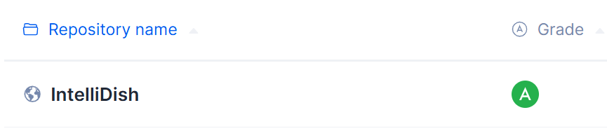
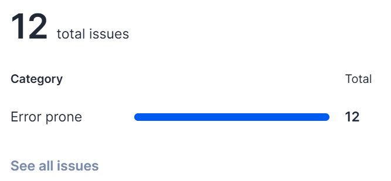
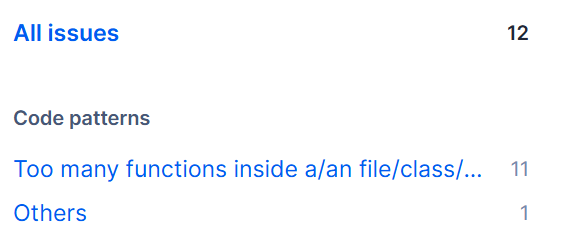

# M5: Testing and Code Review

## 1. Change History

| **Change Date**   | **Modified Sections** | **Rationale** |
| ----------------- | --------------------- | ------------- |
| _Nothing to show_ |

---

## 2. Back-end Test Specification: APIs

### 2.1. Locations of Back-end Tests and Instructions to Run Them

#### 2.1.1. Tests

| **Interface**                                | **Describe Group Location, No Mocks**                                    | **Describe Group Location, With Mocks**                                | **Mocked Components**              |
|---------------------------------------------|------------------------------------------------------------------------|----------------------------------------------------------------------|-----------------------------------|
| **GET /ingredients**                         | `tests/jest_unmocked/getAllIngredients_um.test.ts`                      | `tests/jest_mocked/getAllIngredients_m.test.ts`                        | Ingredients DB                     |
| **GET /ingredients/id/:id**                  | `tests/jest_unmocked/getIngredientById_um.test.ts`                      | `tests/jest_mocked/getIngredientById_m.test.ts`                        | Ingredients DB                     |
| **GET /ingredients/name**                    | `tests/jest_unmocked/getIngredientByName_um.test.ts`                    | `tests/jest_mocked/getIngredientByName_m.test.ts`                      | Ingredients DB                     |
| **POST /ingredients**                        | `tests/jest_unmocked/postNewIngredient_um.test.ts`                      | `tests/jest_mocked/postNewIngredient_m.test.ts`                        | Ingredients DB                     |
| **PUT /ingredients/:id**                     | `tests/jest_unmocked/putIngredientById_um.test.ts`                      | `tests/jest_mocked/putIngredientById_m.test.ts`                        | Ingredients DB                     |
| **DELETE /ingredients/:id**                  | `tests/jest_unmocked/deleteIngredientById_um.test.ts`                   | `tests/jest_mocked/deleteIngredientById_m.test.ts`                     | Ingredients DB                     |
| **GET /recipes**                            | `tests/jest_unmocked/getAllRecipes_um.test.ts`                          | `tests/jest_mocked/getAllRecipes_m.test.ts`                            | Recipes DB                         |
| **GET /recipes/id/:id**                     | `tests/jest_unmocked/getRecipeById_um.test.ts`                          | `tests/jest_mocked/getRecipeById_m.test.ts`                            | Recipes DB                         |
| **GET /recipes/name**                       | `tests/jest_unmocked/getRecipeByName_um.test.ts`                        | `tests/jest_mocked/getRecipeByName_m.test.ts`                          | Recipes DB                         |
| **GET /recipes/:id/getIngredientDetails**   | `tests/jest_unmocked/getIngredientsFromRecipeId_um.test.ts`            | `tests/jest_mocked/getIngredientsFromRecipeId_m.test.ts`               | Recipes DB, Ingredients DB         |
| **POST /recipes**                           | `tests/jest_unmocked/postNewRecipe_um.test.ts`                          | `tests/jest_mocked/postNewRecipe_m.test.ts`                            | Recipes DB                         |
| **POST /recipes/AI**                        | `tests/jest_unmocked/postNewRecipeFromAI_um.test.ts`                    | `tests/jest_mocked/postNewRecipeFromAI_m.test.ts`                      | Recipes DB, OpenAI API             |
| **PUT /recipes/:_id**                       | `tests/jest_unmocked/putRecipeById_um.test.ts`                          | `tests/jest_mocked/putRecipeById_m.test.ts`                            | Recipes DB                         |
| **DELETE /recipes/:_id**                    | `tests/jest_unmocked/deleteRecipeById_um.test.ts`                       | `tests/jest_mocked/deleteRecipeById_m.test.ts`                         | Recipes DB                         |
| **GET /users**                              | `tests/jest_unmocked/userBasicOperations_um.test.ts`                    | `tests/jest_mocked/userBasicOperations_m.test.ts`                      | Users DB                           |
| **GET /users/id/:id**                       | `tests/jest_unmocked/userBasicOperations_um.test.ts`                    | `tests/jest_mocked/userBasicOperations_m.test.ts`                      | Users DB                           |
| **GET /users/email/:email**                 | `tests/jest_unmocked/userBasicOperations_um.test.ts`                    | `tests/jest_mocked/userBasicOperations_m.test.ts`                      | Users DB                           |
| **POST /users**                             | `tests/jest_unmocked/userBasicOperations_um.test.ts`                    | `tests/jest_mocked/userBasicOperations_m.test.ts`                      | Users DB                           |
| **PUT /users/:id/name**                     | `tests/jest_unmocked/userBasicOperations_um.test.ts`                    | `tests/jest_mocked/userBasicOperations_m.test.ts`                      | Users DB                           |
| **DELETE /users/:id**                       | `tests/jest_unmocked/userBasicOperations_um.test.ts`                    | `tests/jest_mocked/userBasicOperations_m.test.ts`                      | Users DB                           |
| **PUT /users/:id/addFriend**                | `tests/jest_unmocked/userFriendOperations_um.test.ts`                   | `tests/jest_mocked/userFriendOperations_m.test.ts`                     | Users DB                           |
| **PUT /users/:id/deleteFriend**             | `tests/jest_unmocked/userFriendOperations_um.test.ts`                   | `tests/jest_mocked/userFriendOperations_m.test.ts`                     | Users DB                           |
| **GET /users/:id/friends**                  | `tests/jest_unmocked/userFriendOperations_um.test.ts`                   | `tests/jest_mocked/userFriendOperations_m.test.ts`                     | Users DB                           |
| **GET /potluck**                            | `tests/jest_unmocked/userPotluckOperations_um.test.ts`                  | `tests/jest_mocked/userPotluckOperations_m.test.ts`                    | Users DB, Potluck DB               |
| **GET /potluck/:id**                        | `tests/jest_unmocked/userPotluckOperations_um.test.ts`                  | `tests/jest_mocked/userPotluckOperations_m.test.ts`                    | Users DB, Potluck DB               |
| **POST /potluck**                           | `tests/jest_unmocked/userPotluckOperations_um.test.ts`                  | `tests/jest_mocked/userPotluckOperations_m.test.ts`                    | Users DB, Potluck DB               |
| **PUT /potluck/:id/ingredients**            | `tests/jest_unmocked/userPotluckOperations_um.test.ts`                  | `tests/jest_mocked/userPotluckOperations_m.test.ts`                    | Users DB, Potluck DB               |
| **DELETE /potluck/:id/ingredients**         | `tests/jest_unmocked/userPotluckOperations_um.test.ts`                  | `tests/jest_mocked/userPotluckOperations_m.test.ts`                    | Users DB, Potluck DB               |
| **PUT /potluck/:id/participants**           | `tests/jest_unmocked/userPotluckOperations_um.test.ts`                  | `tests/jest_mocked/userPotluckOperations_m.test.ts`                    | Users DB, Potluck DB               |
| **PUT /potluck/AI/:id**                     | `tests/jest_unmocked/userPotluckOperations_um.test.ts`                  | `tests/jest_mocked/userPotluckOperations_m.test.ts`                    | Users DB, Potluck DB, OpenAI API   |
| **DELETE /potluck/:id**                     | `tests/jest_unmocked/userPotluckOperations_um.test.ts`                  | `tests/jest_mocked/userPotluckOperations_m.test.ts`                    | Users DB, Potluck DB               |
#### 2.1.2. Commit Hash Where Tests Run

`[Insert Commit SHA here]`

#### 2.1.3. Explanation on How to Run the Tests

1. **Clone the Repository**:

   - Open your terminal and run:
     ```
     git clone https://github.com/example/your-project.git
     ```

2. **...**

### 2.2. GitHub Actions Configuration Location

`~/.github/workflows/backend-tests.yml`

### 2.3. Jest Coverage Report Screenshots With Mocks

_(Placeholder for Jest coverage screenshot with mocks enabled)_

### 2.4. Jest Coverage Report Screenshots Without Mocks

_(Placeholder for Jest coverage screenshot without mocks)_

---

## 3. Back-end Test Specification: Tests of Non-Functional Requirements

### 3.1. Test Locations in Git

| **Non-Functional Requirement**  | **Location in Git**                              |
| ------------------------------- | ------------------------------------------------ |
| **Performance (Response Time)** | [`tests/nonfunctional/response_time.test.js`](#) |
| **Chat Data Security**          | [`tests/nonfunctional/chat_security.test.js`](#) |

### 3.2. Test Verification and Logs

- **Performance (Response Time)**

  - **Verification:** This test suite simulates multiple concurrent API calls using Jest along with a load-testing utility to mimic real-world user behavior. The focus is on key endpoints such as user login and study group search to ensure that each call completes within the target response time of 2 seconds under normal load. The test logs capture metrics such as average response time, maximum response time, and error rates. These logs are then analyzed to identify any performance bottlenecks, ensuring the system can handle expected traffic without degradation in user experience.
  - **Log Output**
    ```
    [Placeholder for response time test logs]
    ```

- **Chat Data Security**
  - **Verification:** ...
  - **Log Output**
    ```
    [Placeholder for chat security test logs]
    ```

---

## 4. Front-end Test Specification

### 4.1. Location in Git of Front-end Test Suite:

`frontend/app/src/androidTest/java/com/example/intellidish`

### 4.2. Tests

- **Use Case: Get Full Recipe Recommendation**

  - **Expected Behaviors:**
    | **Scenario Steps** | **Test Case Steps** |
    | ------------------ | ------------------- |
    | 1. The user clicks the "Get Recommendation" button on the main page to access the "Get Recipe Recommendation" feature. | Open "Get Recommendation" page |
    | 2. The app displays the following UI components:<br> - Text Field labeled “Enter ingredients”<br> - Add Ingredient (button)<br> - Upload Image (button)<br> - View Image (button)<br> - Ingredient List Display (large rectangular container for added ingredients)<br> - Clear Ingredients (button)<br> - Cuisine Type (button)<br> - Preferences (button)<br> - Reset Cuisine Type and Preferences (button)<br> - Allow Partial Recipe Recommendations (toggle switch)<br> - Generate Recipes (button) | Check all UI components are present|
    | 3a. The user attempts to add an ingredient without entering any text input. | Click "Add Ingredient" |
    | 3a1. Display an error message: “Please enter at least one ingredient!” | Check dialog is opened with text: "Please enter at least one ingredient!” |
    | 3b. The user does not enter any ingredient before clicking "Generate Recipes". | Click "Generate Recipes"|
    | 3b1. Display an error message: “Please add at least one ingredient!” | Check dialog is opened with text: "Please add at least one ingredient!” |
    | 3. The user enters a list of available ingredients and selects cuisine preferences. | Input "egg" in text field<br> Click "Add Ingredient" button<br> Input "tomato" in text field<br> Click "Add Ingredient" button<br> Check "egg" and "tomato" are added to the ingredient list recycler view<br> Click "Cuisine Type"<br> Select "Chinese"<br> Click "Apply"<br> Click "Preferences"<br> Change "Recipe Complexity" to "2" |
    | 4. The app sends a request to the AI API with the provided inputs. | Click "Generate Recipes" |
    | 5. The AI API returns a possible recipe to the user. | Check a recipe is displayed |
    

  - **Test Logs:**
   ```
   2025-03-11 22:42:00: Launching GetFullRecipeRecommendationTest on 'Pixel 9 API 31.
   Running tests
   Executing tasks: [:app:connectedDebugAndroidTest] in project /Users/angelawork/Desktop/IntelliDish-frontend
   
   
   > Configure project :app
   AGPBI: {"kind":"warning","text":"The option setting 'android.experimental.testOptions.emulatorSnapshots.maxSnapshotsForTestFailures=0' is experimental.","sources":[{}]}
   
   > Task :app:checkKotlinGradlePluginConfigurationErrors SKIPPED
   > Task :app:preBuild UP-TO-DATE
   > Task :app:preDebugBuild UP-TO-DATE
   > Task :app:dataBindingMergeDependencyArtifactsDebug UP-TO-DATE
   > Task :app:generateDebugResValues UP-TO-DATE
   > Task :app:generateDebugResources UP-TO-DATE
   > Task :app:mergeDebugResources UP-TO-DATE
   > Task :app:packageDebugResources UP-TO-DATE
   > Task :app:parseDebugLocalResources UP-TO-DATE
   > Task :app:dataBindingGenBaseClassesDebug UP-TO-DATE
   > Task :app:generateDebugBuildConfig UP-TO-DATE
   > Task :app:checkDebugAarMetadata UP-TO-DATE
   > Task :app:mapDebugSourceSetPaths UP-TO-DATE
   > Task :app:createDebugCompatibleScreenManifests UP-TO-DATE
   > Task :app:extractDeepLinksDebug UP-TO-DATE
   > Task :app:processDebugMainManifest UP-TO-DATE
   > Task :app:processDebugManifest UP-TO-DATE
   > Task :app:processDebugManifestForPackage UP-TO-DATE
   > Task :app:processDebugResources UP-TO-DATE
   > Task :app:compileDebugKotlin UP-TO-DATE
   > Task :app:javaPreCompileDebug UP-TO-DATE
   > Task :app:compileDebugJavaWithJavac UP-TO-DATE
   > Task :app:bundleDebugClassesToCompileJar UP-TO-DATE
   > Task :app:preDebugAndroidTestBuild SKIPPED
   > Task :app:dataBindingMergeDependencyArtifactsDebugAndroidTest UP-TO-DATE
   > Task :app:generateDebugAndroidTestResValues UP-TO-DATE
   > Task :app:generateDebugAndroidTestResources UP-TO-DATE
   > Task :app:mergeDebugAndroidTestResources UP-TO-DATE
   > Task :app:dataBindingGenBaseClassesDebugAndroidTest UP-TO-DATE
   > Task :app:processDebugAndroidTestManifest UP-TO-DATE
   > Task :app:generateDebugAndroidTestBuildConfig UP-TO-DATE
   > Task :app:checkDebugAndroidTestAarMetadata UP-TO-DATE
   > Task :app:mapDebugAndroidTestSourceSetPaths UP-TO-DATE
   > Task :app:processDebugAndroidTestResources UP-TO-DATE
   > Task :app:compileDebugAndroidTestKotlin UP-TO-DATE
   > Task :app:javaPreCompileDebugAndroidTest UP-TO-DATE
   > Task :app:compileDebugAndroidTestJavaWithJavac UP-TO-DATE
   > Task :app:mergeDebugShaders UP-TO-DATE
   > Task :app:compileDebugShaders NO-SOURCE
   > Task :app:generateDebugAssets UP-TO-DATE
   > Task :app:mergeDebugAssets UP-TO-DATE
   > Task :app:compressDebugAssets UP-TO-DATE
   > Task :app:processDebugJavaRes UP-TO-DATE
   > Task :app:mergeDebugJavaResource UP-TO-DATE
   > Task :app:checkDebugDuplicateClasses UP-TO-DATE
   > Task :app:desugarDebugFileDependencies UP-TO-DATE
   > Task :app:mergeExtDexDebug UP-TO-DATE
   > Task :app:mergeLibDexDebug UP-TO-DATE
   > Task :app:dexBuilderDebug UP-TO-DATE
   > Task :app:mergeProjectDexDebug UP-TO-DATE
   > Task :app:mergeDebugJniLibFolders UP-TO-DATE
   > Task :app:mergeDebugNativeLibs NO-SOURCE
   > Task :app:stripDebugDebugSymbols NO-SOURCE
   > Task :app:validateSigningDebug UP-TO-DATE
   > Task :app:writeDebugAppMetadata UP-TO-DATE
   > Task :app:writeDebugSigningConfigVersions UP-TO-DATE
   > Task :app:packageDebug UP-TO-DATE
   > Task :app:createDebugApkListingFileRedirect UP-TO-DATE
   > Task :app:mergeDebugAndroidTestShaders UP-TO-DATE
   > Task :app:compileDebugAndroidTestShaders NO-SOURCE
   > Task :app:generateDebugAndroidTestAssets UP-TO-DATE
   > Task :app:mergeDebugAndroidTestAssets UP-TO-DATE
   > Task :app:compressDebugAndroidTestAssets UP-TO-DATE
   > Task :app:processDebugAndroidTestJavaRes UP-TO-DATE
   > Task :app:mergeDebugAndroidTestJavaResource UP-TO-DATE
   > Task :app:checkDebugAndroidTestDuplicateClasses UP-TO-DATE
   > Task :app:desugarDebugAndroidTestFileDependencies UP-TO-DATE
   > Task :app:mergeExtDexDebugAndroidTest UP-TO-DATE
   > Task :app:mergeLibDexDebugAndroidTest UP-TO-DATE
   > Task :app:dexBuilderDebugAndroidTest UP-TO-DATE
   > Task :app:mergeProjectDexDebugAndroidTest UP-TO-DATE
   > Task :app:mergeDebugAndroidTestJniLibFolders UP-TO-DATE
   > Task :app:mergeDebugAndroidTestNativeLibs NO-SOURCE
   > Task :app:stripDebugAndroidTestDebugSymbols NO-SOURCE
   > Task :app:validateSigningDebugAndroidTest UP-TO-DATE
   > Task :app:writeDebugAndroidTestSigningConfigVersions UP-TO-DATE
   > Task :app:packageDebugAndroidTest UP-TO-DATE
   > Task :app:createDebugAndroidTestApkListingFileRedirect UP-TO-DATE
   Connected to process 11134 on device 'emulator-5554'.
   
   > Task :app:connectedDebugAndroidTest
   Starting 5 tests on Pixel_9_API_31(AVD) - 12
   
   Pixel_9_API_31(AVD) - 12 Tests 2/5 completed. (0 skipped) (0 failed)
   Pixel_9_API_31(AVD) - 12 Tests 4/5 completed. (0 skipped) (0 failed)
   Finished 5 tests on Pixel_9_API_31(AVD) - 12
   
   BUILD SUCCESSFUL in 39s
   67 actionable tasks: 1 executed, 66 up-to-date
   
   Build Analyzer results available
   ```

- **Use Case: Participate In PotLuck**

  - **Expected Behaviors:**

    | **Scenario Steps** | **Test Case Steps** |
    | ------------------ | ------------------- |
    | 1. The user clicks the "PotLuck" button on the main page to access the "Participate In PotLuck" feature. | Open "PotLuck" page |
    | 2. The app displays the following UI components:<br> - ALL JOINED POTLUCK (button)<br> - CREATE NEW POTLUCK (button)<br> - Text Field labeled "Search for PotLucks"<br> - JOIN SELECTED POTLUCK (button)<br> - Existing PotLucks Display (large rectangular container for existing potlucks) | Check all UI components are present |
    | 3a. The user clicks "CREATE POTLUCK" without entering a potluck name. | Click "CREATE NEW POTLUCK"<br>Click "CREATE POTLUCK"<br>Check dialog is opened with text: "Please enter a potluck name!”  |
    | 3. The user starts a PotLuck and adds their friends to create a group. | Input "Family potluck" in text field<br>Click "Add Participants" to unroll the section<br>Click on the friend's name to select<br>Click "Add Participant"<br>Check the friend is added<br>Click "Add Participants" to roll up the section<br>Click "CREATE POTLUCK" |
    | 4. Each user independently adds or removes their ingredient contributions and sets cuisine type and preferences within the PotLuck group. Live updates ensure real-time synchronization across all participants. | Click "ALL JOINED POTLUCKS"<br>Click "Family potluck"<br>Input "bacon" in text field<br>Input "egg" in text field<br>Input "tomato" in text field<br>Click "x" beside "Bacon" to delete it<br>Check only "Egg" and "Tomato" are displayed<br>Click "Cuisine Type"<br>Select "French"<br>Click "APPLY"<br>Click "Preferences"<br>Change "Nutritional Value" to "5"<br>Click "APPLY" |
    | 5. A request is sent to the AI API based on the combined user inputs. | Click "Generate Recipes" |
    | 6. The AI API returns a possible recipe based on the collective ingredients. | Check a recipe is displayed |

  - **Test Logs:**
   ```
   2025-03-12 22:48:32: Launching ParticipateInPotluckTest on 'Pixel 9 API 31.
   Running tests
   Executing tasks: [:app:connectedDebugAndroidTest] in project /Users/angelawork/Desktop/IntelliDish-frontend
   
   
   > Configure project :app
   AGPBI: {"kind":"warning","text":"The option setting 'android.experimental.testOptions.emulatorSnapshots.maxSnapshotsForTestFailures=0' is experimental.","sources":[{}]}
   
   > Task :app:checkKotlinGradlePluginConfigurationErrors SKIPPED
   > Task :app:preBuild UP-TO-DATE
   > Task :app:preDebugBuild UP-TO-DATE
   > Task :app:dataBindingMergeDependencyArtifactsDebug UP-TO-DATE
   > Task :app:generateDebugResValues UP-TO-DATE
   > Task :app:generateDebugResources UP-TO-DATE
   > Task :app:mergeDebugResources UP-TO-DATE
   > Task :app:packageDebugResources UP-TO-DATE
   > Task :app:parseDebugLocalResources UP-TO-DATE
   > Task :app:dataBindingGenBaseClassesDebug UP-TO-DATE
   > Task :app:generateDebugBuildConfig UP-TO-DATE
   > Task :app:checkDebugAarMetadata UP-TO-DATE
   > Task :app:mapDebugSourceSetPaths UP-TO-DATE
   > Task :app:createDebugCompatibleScreenManifests UP-TO-DATE
   > Task :app:extractDeepLinksDebug UP-TO-DATE
   > Task :app:processDebugMainManifest UP-TO-DATE
   > Task :app:processDebugManifest UP-TO-DATE
   > Task :app:processDebugManifestForPackage UP-TO-DATE
   > Task :app:javaPreCompileDebug UP-TO-DATE
   > Task :app:preDebugAndroidTestBuild SKIPPED
   > Task :app:dataBindingMergeDependencyArtifactsDebugAndroidTest UP-TO-DATE
   > Task :app:generateDebugAndroidTestResValues UP-TO-DATE
   > Task :app:generateDebugAndroidTestResources UP-TO-DATE
   > Task :app:mergeDebugAndroidTestResources UP-TO-DATE
   > Task :app:dataBindingGenBaseClassesDebugAndroidTest UP-TO-DATE
   > Task :app:processDebugAndroidTestManifest UP-TO-DATE
   > Task :app:generateDebugAndroidTestBuildConfig UP-TO-DATE
   > Task :app:checkDebugAndroidTestAarMetadata UP-TO-DATE
   > Task :app:mapDebugAndroidTestSourceSetPaths UP-TO-DATE
   > Task :app:processDebugAndroidTestResources UP-TO-DATE
   > Task :app:javaPreCompileDebugAndroidTest UP-TO-DATE
   > Task :app:mergeDebugShaders UP-TO-DATE
   > Task :app:compileDebugShaders NO-SOURCE
   > Task :app:generateDebugAssets UP-TO-DATE
   > Task :app:mergeDebugAssets UP-TO-DATE
   > Task :app:compressDebugAssets UP-TO-DATE
   > Task :app:checkDebugDuplicateClasses UP-TO-DATE
   > Task :app:desugarDebugFileDependencies UP-TO-DATE
   > Task :app:mergeExtDexDebug UP-TO-DATE
   > Task :app:mergeLibDexDebug UP-TO-DATE
   > Task :app:mergeDebugJniLibFolders UP-TO-DATE
   > Task :app:mergeDebugNativeLibs NO-SOURCE
   > Task :app:stripDebugDebugSymbols NO-SOURCE
   > Task :app:validateSigningDebug UP-TO-DATE
   > Task :app:writeDebugAppMetadata UP-TO-DATE
   > Task :app:writeDebugSigningConfigVersions UP-TO-DATE
   > Task :app:mergeDebugAndroidTestShaders UP-TO-DATE
   > Task :app:compileDebugAndroidTestShaders NO-SOURCE
   > Task :app:generateDebugAndroidTestAssets UP-TO-DATE
   > Task :app:mergeDebugAndroidTestAssets UP-TO-DATE
   > Task :app:compressDebugAndroidTestAssets UP-TO-DATE
   > Task :app:checkDebugAndroidTestDuplicateClasses UP-TO-DATE
   > Task :app:desugarDebugAndroidTestFileDependencies UP-TO-DATE
   > Task :app:mergeExtDexDebugAndroidTest UP-TO-DATE
   > Task :app:mergeLibDexDebugAndroidTest UP-TO-DATE
   > Task :app:mergeDebugAndroidTestJniLibFolders UP-TO-DATE
   > Task :app:mergeDebugAndroidTestNativeLibs NO-SOURCE
   > Task :app:stripDebugAndroidTestDebugSymbols NO-SOURCE
   > Task :app:validateSigningDebugAndroidTest UP-TO-DATE
   > Task :app:writeDebugAndroidTestSigningConfigVersions UP-TO-DATE
   > Task :app:processDebugResources
   > Task :app:compileDebugKotlin UP-TO-DATE
   > Task :app:compileDebugJavaWithJavac UP-TO-DATE
   > Task :app:bundleDebugClassesToCompileJar UP-TO-DATE
   > Task :app:processDebugJavaRes UP-TO-DATE
   > Task :app:mergeDebugJavaResource UP-TO-DATE
   > Task :app:dexBuilderDebug UP-TO-DATE
   > Task :app:mergeProjectDexDebug UP-TO-DATE
   > Task :app:packageDebug UP-TO-DATE
   > Task :app:createDebugApkListingFileRedirect UP-TO-DATE
   
   > Task :app:compileDebugAndroidTestKotlin
   w: file:///Users/angelawork/Desktop/IntelliDish-frontend/app/src/androidTest/java/com/example/intellidish/ParticipateInPotluckTest.kt:15:8 'class AndroidJUnit4 : Runner, Filterable, Sortable' is deprecated. Deprecated in Java.
   w: file:///Users/angelawork/Desktop/IntelliDish-frontend/app/src/androidTest/java/com/example/intellidish/ParticipateInPotluckTest.kt:26:10 'class AndroidJUnit4 : Runner, Filterable, Sortable' is deprecated. Deprecated in Java.
   
   > Task :app:compileDebugAndroidTestJavaWithJavac UP-TO-DATE
   > Task :app:processDebugAndroidTestJavaRes UP-TO-DATE
   > Task :app:mergeDebugAndroidTestJavaResource UP-TO-DATE
   > Task :app:dexBuilderDebugAndroidTest
   > Task :app:mergeProjectDexDebugAndroidTest
   > Task :app:packageDebugAndroidTest
   > Task :app:createDebugAndroidTestApkListingFileRedirect UP-TO-DATE
   Connected to process 3171 on device 'emulator-5554'.
   
   > Task :app:connectedDebugAndroidTest
   Starting 5 tests on Pixel_9_API_31(AVD) - 12
   
   Pixel_9_API_31(AVD) - 12 Tests 2/5 completed. (0 skipped) (0 failed)
   Pixel_9_API_31(AVD) - 12 Tests 3/5 completed. (0 skipped) (0 failed)
   Pixel_9_API_31(AVD) - 12 Tests 4/5 completed. (0 skipped) (0 failed)
   Finished 5 tests on Pixel_9_API_31(AVD) - 12
   
   BUILD SUCCESSFUL in 47s
   67 actionable tasks: 6 executed, 61 up-to-date
   
   Build Analyzer results available
   ```

- **Use Case: Manage Friends**

  - **Expected Behaviors:**

    | **Scenario Steps** | **Test Case Steps** |
    | ------------------ | ------------------- |
    | 1. The user clicks the "Manage Friends" button on the main page to access the "Manage Friends" feature. | Open "Manage Friends" page |
    | 2. The app displays the following UI components:<br> - Text Field for friend search by email.<br> - Add Friend (button)<br> - Friend List, or text saying there are currently no friends. | Check all UI components are present |
    | 3a. The friend addition fails because the entered username is invalid/ cannot be found. | Input "xxxxx" in text field |
    | 3a1. Display error message for the user to double check that the entered username for friend addition is correct, and prompt the user to try again. Removal of friends do not fail. | Check dialog is opened with text: "Please enter a valid email address” |
    | 3b. The user attempts to add themselves as a friend. | Input current user's email address |
    | 3b1. Display error message that the user cannot add himself/ herself as a friend. | Check dialog is opened with text: "You cannot add yourself as a friend |
    | 3. The user enters the username of a user to add as a friend. | Input a valid username |
    | 3c. The user attempts to add an existing friend as a friend again. | Input an existing friend's username |
    | 3c1. Display error message that the user is already friends with the existing friend. | Check dialog is opened with text: "You are already friends with this user" |
    | 3. The user chooses a user from his/ her existing friend list to remove. | Click "Remove" under that user |
    | 4. System asks the user for confirmation of friend removal. | Click "Remove" |
    | 5. The user's friend list is updated with the addition/ removal of a friend. | Check if the friend list is updated |

  - **Test Logs:**
   ```
   2025-03-11 23:48:40: Launching ManageFriendsTest on 'Pixel 9 API 31.
   Running tests
   Executing tasks: [:app:connectedDebugAndroidTest] in project /Users/angelawork/Desktop/IntelliDish-frontend
   
   
   > Configure project :app
   AGPBI: {"kind":"warning","text":"The option setting 'android.experimental.testOptions.emulatorSnapshots.maxSnapshotsForTestFailures=0' is experimental.","sources":[{}]}
   
   > Task :app:checkKotlinGradlePluginConfigurationErrors SKIPPED
   > Task :app:preBuild UP-TO-DATE
   > Task :app:preDebugBuild UP-TO-DATE
   > Task :app:dataBindingMergeDependencyArtifactsDebug UP-TO-DATE
   > Task :app:generateDebugResValues UP-TO-DATE
   > Task :app:generateDebugResources UP-TO-DATE
   > Task :app:mergeDebugResources UP-TO-DATE
   > Task :app:packageDebugResources UP-TO-DATE
   > Task :app:parseDebugLocalResources UP-TO-DATE
   > Task :app:dataBindingGenBaseClassesDebug UP-TO-DATE
   > Task :app:generateDebugBuildConfig UP-TO-DATE
   > Task :app:checkDebugAarMetadata UP-TO-DATE
   > Task :app:mapDebugSourceSetPaths UP-TO-DATE
   > Task :app:createDebugCompatibleScreenManifests UP-TO-DATE
   > Task :app:extractDeepLinksDebug UP-TO-DATE
   > Task :app:processDebugMainManifest UP-TO-DATE
   > Task :app:processDebugManifest UP-TO-DATE
   > Task :app:processDebugManifestForPackage UP-TO-DATE
   > Task :app:javaPreCompileDebug UP-TO-DATE
   > Task :app:preDebugAndroidTestBuild SKIPPED
   > Task :app:dataBindingMergeDependencyArtifactsDebugAndroidTest UP-TO-DATE
   > Task :app:generateDebugAndroidTestResValues UP-TO-DATE
   > Task :app:generateDebugAndroidTestResources UP-TO-DATE
   > Task :app:mergeDebugAndroidTestResources UP-TO-DATE
   > Task :app:dataBindingGenBaseClassesDebugAndroidTest UP-TO-DATE
   > Task :app:processDebugAndroidTestManifest UP-TO-DATE
   > Task :app:generateDebugAndroidTestBuildConfig UP-TO-DATE
   > Task :app:checkDebugAndroidTestAarMetadata UP-TO-DATE
   > Task :app:mapDebugAndroidTestSourceSetPaths UP-TO-DATE
   > Task :app:processDebugAndroidTestResources UP-TO-DATE
   > Task :app:javaPreCompileDebugAndroidTest UP-TO-DATE
   > Task :app:mergeDebugShaders UP-TO-DATE
   > Task :app:compileDebugShaders NO-SOURCE
   > Task :app:generateDebugAssets UP-TO-DATE
   > Task :app:mergeDebugAssets UP-TO-DATE
   > Task :app:compressDebugAssets UP-TO-DATE
   > Task :app:checkDebugDuplicateClasses UP-TO-DATE
   > Task :app:desugarDebugFileDependencies UP-TO-DATE
   > Task :app:mergeExtDexDebug UP-TO-DATE
   > Task :app:mergeLibDexDebug UP-TO-DATE
   > Task :app:mergeDebugJniLibFolders UP-TO-DATE
   > Task :app:mergeDebugNativeLibs NO-SOURCE
   > Task :app:stripDebugDebugSymbols NO-SOURCE
   > Task :app:validateSigningDebug UP-TO-DATE
   > Task :app:writeDebugAppMetadata UP-TO-DATE
   > Task :app:writeDebugSigningConfigVersions UP-TO-DATE
   > Task :app:mergeDebugAndroidTestShaders UP-TO-DATE
   > Task :app:compileDebugAndroidTestShaders NO-SOURCE
   > Task :app:generateDebugAndroidTestAssets UP-TO-DATE
   > Task :app:mergeDebugAndroidTestAssets UP-TO-DATE
   > Task :app:compressDebugAndroidTestAssets UP-TO-DATE
   > Task :app:checkDebugAndroidTestDuplicateClasses UP-TO-DATE
   > Task :app:desugarDebugAndroidTestFileDependencies UP-TO-DATE
   > Task :app:mergeExtDexDebugAndroidTest UP-TO-DATE
   > Task :app:mergeLibDexDebugAndroidTest UP-TO-DATE
   > Task :app:mergeDebugAndroidTestJniLibFolders UP-TO-DATE
   > Task :app:mergeDebugAndroidTestNativeLibs NO-SOURCE
   > Task :app:stripDebugAndroidTestDebugSymbols NO-SOURCE
   > Task :app:validateSigningDebugAndroidTest UP-TO-DATE
   > Task :app:writeDebugAndroidTestSigningConfigVersions UP-TO-DATE
   > Task :app:processDebugResources
   > Task :app:compileDebugKotlin UP-TO-DATE
   > Task :app:compileDebugJavaWithJavac UP-TO-DATE
   > Task :app:bundleDebugClassesToCompileJar UP-TO-DATE
   > Task :app:processDebugJavaRes UP-TO-DATE
   > Task :app:mergeDebugJavaResource UP-TO-DATE
   > Task :app:dexBuilderDebug UP-TO-DATE
   > Task :app:mergeProjectDexDebug UP-TO-DATE
   > Task :app:packageDebug UP-TO-DATE
   > Task :app:createDebugApkListingFileRedirect UP-TO-DATE
   
   > Task :app:compileDebugAndroidTestKotlin
   w: file:///Users/angelawork/Desktop/IntelliDish-frontend/app/src/androidTest/java/com/example/intellidish/ManageFriendsTest.kt:11:8 'class AndroidJUnit4 : Runner, Filterable, Sortable' is deprecated. Deprecated in Java.
   w: file:///Users/angelawork/Desktop/IntelliDish-frontend/app/src/androidTest/java/com/example/intellidish/ManageFriendsTest.kt:21:10 'class AndroidJUnit4 : Runner, Filterable, Sortable' is deprecated. Deprecated in Java.
   
   > Task :app:compileDebugAndroidTestJavaWithJavac UP-TO-DATE
   Java compiler version 21 has deprecated support for compiling with source/target version 8.
   Try one of the following options:
       1. [Recommended] Use Java toolchain with a lower language version
       2. Set a higher source/target version
       3. Use a lower version of the JDK running the build (if you're not using Java toolchain)
   For more details on how to configure these settings, see https://developer.android.com/build/jdks.
   To suppress this warning, set android.javaCompile.suppressSourceTargetDeprecationWarning=true in gradle.properties.
   
   > Task :app:processDebugAndroidTestJavaRes UP-TO-DATE
   > Task :app:mergeDebugAndroidTestJavaResource UP-TO-DATE
   > Task :app:dexBuilderDebugAndroidTest
   > Task :app:mergeProjectDexDebugAndroidTest
   > Task :app:packageDebugAndroidTest
   > Task :app:createDebugAndroidTestApkListingFileRedirect UP-TO-DATE
   Connected to process 29378 on device 'emulator-5554'.
   
   > Task :app:connectedDebugAndroidTest
   Starting 7 tests on Pixel_9_API_31(AVD) - 12
   
   Pixel_9_API_31(AVD) - 12 Tests 2/7 completed. (0 skipped) (0 failed)
   Pixel_9_API_31(AVD) - 12 Tests 5/7 completed. (0 skipped) (0 failed)
   Finished 7 tests on Pixel_9_API_31(AVD) - 12
   
   BUILD SUCCESSFUL in 35s
   67 actionable tasks: 6 executed, 61 up-to-date
   
   Build Analyzer results available
   ```

---

## 5. Automated Code Review Results

### 5.1. Commit Hash Where Codacy Ran

`[221f6f741d2a9e5d164effe2844f193f098cc88a]`
<div style="border: 2px solid black; display: inline-block;">
    
</div>

### 5.2. Unfixed Issues per Codacy Category

<div style="border: 2px solid black; display: inline-block;">
    
</div>

### 5.3. Unfixed Issues per Codacy Code Pattern

<div style="border: 2px solid black; display: inline-block;">
    
</div>

More detailes about each individual issue can be found in section 5.4 below.

### 5.4. Justifications for Unfixed Issues
**Category:** Error Prone  

**Code Pattern:** Too many functions inside a/an file/class/object/interface always indicate a violation of the single responsibility principle. Maybe the file/class/object/interface wants to manage too many things at once.  

**Justification:** For all issues regarding too many functions inside a file/ class/ object/ interface, we decided to not separate existing files/ classes/ objects/ interfaces into smaller ones with less functions each because all functions in our classes/files belong together semantically. For example, all functions for managing recipes are in the “ManageRecipes” class in the ManageRecipes.kt file. When one is looking for code related to managing recipes, it can all be conveniently found in the single class/ file, and splitting into multiple classes/ files with fewer functions may actually cause more confusion. This logic applies to the other files/ classes/ objects/ interfaces listed in these issues.  

|          | **Issue**                                                       | **Location in Git**                                              |
|----------|-----------------------------------------------------------------|------------------------------------------------------------------|
|1 |Class 'ManageRecipes' with '19' functions detected. Defined threshold inside classes is set to '11' |frontend/app/src/main/java/com/example/intellidish/ManageRecipes.kt
|2 |Class 'PreferencesManager' with '23' functions detected. Defined threshold inside classes is set to '11' |frontend/app/src/main/java/com/example/intellidish/utils/PreferencesManager.kt
|3 |Class 'CreatePotluckActivity' with '20' functions detected. Defined threshold inside classes is set to '11' |frontend/app/src/main/java/com/example/intellidish/CreatePotluckActivity.kt
|4 |Class 'GetRecommendation' with '11' functions detected. Defined threshold inside classes is set to '11' |frontend/app/src/main/java/com/example/intellidish/GetRecommendation.kt
|5 |Class 'MainActivity' with '12' functions detected. Defined threshold inside classes is set to '11' |frontend/app/src/main/java/com/example/intellidish/MainActivity.kt
|6 |Class 'PotluckActivity' with '13' functions detected. Defined threshold inside classes is set to '11' |frontend/app/src/main/java/com/example/intellidish/PotluckActivity.kt
|7 |Class 'PotluckDetailActivity' with '31' functions detected. Defined threshold inside classes is set to '11' |frontend/app/src/main/java/com/example/intellidish/PotluckDetailActivity.kt
|8 |Interface 'ApiService' with '26' functions detected. Defined threshold inside interfaces is set to '11' |frontend/app/src/main/java/com/example/intellidish/api/ApiService.kt
|9 |Class 'RecommendationActivity' with '29' functions detected. Defined threshold inside classes is set to '11' |frontend/app/src/main/java/com/example/intellidish/RecommendationActivity.kt
|10 |Class 'ManageFriends' with '20' functions detected. Defined threshold inside classes is set to '11' |frontend/app/src/main/java/com/example/intellidish/ManageFriends.kt
|11 |Object 'UserManager' with '16' functions detected. Defined threshold inside objects is set to '11' |frontend/app/src/main/java/com/example/intellidish/utils/UserManager.kt

---------

**Category:** Error Prone  

**Code Pattern:** Others - Excessive nesting leads to hidden complexity. Prefer extracting code to make it easier to understand.  

**Justification:**  I believe Codacy probably claims that the fetchIngredientsFromServer function is nested too deeply because it counts the try-catch block and if-else statements as 2 layers of "nesting", which is technically true in that they add a layer of depth in the function, but in reality doesn't really make the function "harder to read". Other than this, the function only has a very simple double forEach loop in the following code snippet:  
```
potluck.participants.forEach { participant ->  
   participant.ingredients?.forEach { ing ->
      newIngredients.add(PotluckIngredient(ing, participant.user.name))
   }
}
```
Extracting code into helper functions may actually make the code more convolutes and difficult to read.  

|          | **Issue**                                                       | **Location in Git**                                              |
|----------|-----------------------------------------------------------------|------------------------------------------------------------------|
|1 |Function fetchIngredientsFromServer is nested too deeply.|frontend/app/src/main/java/com/example/intellidish/adapters/PotluckIngredientAdapter.kt

---------

**Category:** Security  

**Code Pattern:** Others - Insecure dependencies detection (critical and high severity)  

**Justification:**  

|          | **Issue**                                                       | **Location in Git**                                              |
|----------|-----------------------------------------------------------------|------------------------------------------------------------------|
|1 |Insecure dependency npm/hoek@2.16.3 (CVE-2020-36604: hapi/hoek: Prototype Pollution in @hapi/hoek) (no fix available)|backend_updated/package-lock.json


