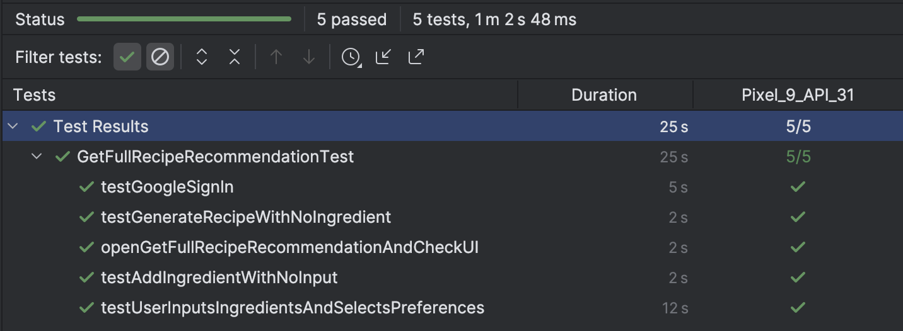

# M5: Testing and Code Review

## 1. Change History

| **Change Date**   | **Modified Sections** | **Rationale** |
| ----------------- | --------------------- | ------------- |
| 03/23 | Section 2.4 - backend/tests/jest_unmocked | The original tests without mocks are tested with API connected. However, it should not start the server when the test begins. The unmocked tests work parallel with the real App. |
| 04/02 | Section 4.2 | The original scenario steps gets too technical. Modification has been made to focus more on the success scenarios rather than UI elements. |
| 04/03 | Section 4.2 | Replaced long text test logs with image logs for clarity. |

---

## 2. Back-end Test Specification: APIs

### 2.1. Locations of Back-end Tests and Instructions to Run Them

#### 2.1.1. Tests

| **Interface**                                | **Describe Group Location, No Mocks**                                    | **Describe Group Location, With Mocks**                                | **Mocked Components**              |
|---------------------------------------------|------------------------------------------------------------------------|----------------------------------------------------------------------|-----------------------------------|
| **GET /ingredients**                         | `backend/tests/jest_unmocked/getAllIngredients_um.test.ts`                      | `backend/tests/jest_mocked/getAllIngredients_m.test.ts`                        | Ingredients DB                     |
| **GET /ingredients/id/:id**                  | `backend/tests/jest_unmocked/getIngredientById_um.test.ts`                      | `backend/tests/jest_mocked/getIngredientById_m.test.ts`                        | Ingredients DB                     |
| **GET /ingredients/name**                    | `backend/tests/jest_unmocked/getIngredientByName_um.test.ts`                    | `backend/tests/jest_mocked/getIngredientByName_m.test.ts`                      | Ingredients DB                     |
| **POST /ingredients**                        | `backend/tests/jest_unmocked/postNewIngredient_um.test.ts`                      | `backend/tests/jest_mocked/postNewIngredient_m.test.ts`                        | Ingredients DB                     |
| **PUT /ingredients/:id**                     | `backend/tests/jest_unmocked/putIngredientById_um.test.ts`                      | `backend/tests/jest_mocked/putIngredientById_m.test.ts`                        | Ingredients DB                     |
| **DELETE /ingredients/:id**                  | `backend/tests/jest_unmocked/deleteIngredientById_um.test.ts`                   | `backend/tests/jest_mocked/deleteIngredientById_m.test.ts`                     | Ingredients DB                     |
| **GET /recipes**                            | `backend/tests/jest_unmocked/getAllRecipes_um.test.ts`                          | `backend/tests/jest_mocked/getAllRecipes_m.test.ts`                            | Recipes DB                         |
| **GET /recipes/id/:id**                     | `backend/tests/jest_unmocked/getRecipeById_um.test.ts`                          | `backend/tests/jest_mocked/getRecipeById_m.test.ts`                            | Recipes DB                         |
| **GET /recipes/name**                       | `backend/tests/jest_unmocked/getRecipeByName_um.test.ts`                        | `backend/tests/jest_mocked/getRecipeByName_m.test.ts`                          | Recipes DB                         |
| **GET /recipes/:id/getIngredientDetails**   | `backend/tests/jest_unmocked/getIngredientsFromRecipeId_um.test.ts`            | `backend/tests/jest_mocked/getIngredientsFromRecipeId_m.test.ts`               | Recipes DB, Ingredients DB         |
| **POST /recipes**                           | `backend/tests/jest_unmocked/postNewRecipe_um.test.ts`                          | `backend/tests/jest_mocked/postNewRecipe_m.test.ts`                            | Recipes DB                         |
| **POST /recipes/AI**                        | `backend/tests/jest_unmocked/postNewRecipeFromAI_um.test.ts`                    | `backend/tests/jest_mocked/postNewRecipeFromAI_m.test.ts`                      | Recipes DB, OpenAI API             |
| **PUT /recipes/:_id**                       | `backend/tests/jest_unmocked/putRecipeById_um.test.ts`                          | `backend/tests/jest_mocked/putRecipeById_m.test.ts`                            | Recipes DB                         |
| **DELETE /recipes/:_id**                    | `backend/tests/jest_unmocked/deleteRecipeById_um.test.ts`                       | `backend/tests/jest_mocked/deleteRecipeById_m.test.ts`                         | Recipes DB                         |
| **GET /users**                              | `backend/tests/jest_unmocked/userBasicOperations_um.test.ts`                    | `backend/tests/jest_mocked/userBasicOperations_m.test.ts`                      | Users DB                           |
| **GET /users/id/:id**                       | `backend/tests/jest_unmocked/userBasicOperations_um.test.ts`                    | `backend/tests/jest_mocked/userBasicOperations_m.test.ts`                      | Users DB                           |
| **GET /users/email/:email**                 | `backend/tests/jest_unmocked/userBasicOperations_um.test.ts`                    | `backend/tests/jest_mocked/userBasicOperations_m.test.ts`                      | Users DB                           |
| **POST /users**                             | `backend/tests/jest_unmocked/userBasicOperations_um.test.ts`                    | `backend/tests/jest_mocked/userBasicOperations_m.test.ts`                      | Users DB                           |
| **PUT /users/:id/name**                     | `backend/tests/jest_unmocked/userBasicOperations_um.test.ts`                    | `backend/tests/jest_mocked/userBasicOperations_m.test.ts`                      | Users DB                           |
| **DELETE /users/:id**                       | `backend/tests/jest_unmocked/userBasicOperations_um.test.ts`                    | `backend/tests/jest_mocked/userBasicOperations_m.test.ts`                      | Users DB                           |
| **PUT /users/:id/addFriend**                | `backend/tests/jest_unmocked/userFriendOperations_um.test.ts`                   | `backend/tests/jest_mocked/userFriendOperations_m.test.ts`                     | Users DB                           |
| **PUT /users/:id/deleteFriend**             | `backend/tests/jest_unmocked/userFriendOperations_um.test.ts`                   | `backend/tests/jest_mocked/userFriendOperations_m.test.ts`                     | Users DB                           |
| **GET /users/:id/friends**                  | `backend/tests/jest_unmocked/userFriendOperations_um.test.ts`                   | `backend/tests/jest_mocked/userFriendOperations_m.test.ts`                     | Users DB                           |
| **GET /potluck**                            | `backend/tests/jest_unmocked/userPotluckOperations_um.test.ts`                  | `backend/tests/jest_mocked/userPotluckOperations_m.test.ts`                    | Users DB, Potluck DB               |
| **GET /potluck/:id**                        | `backend/tests/jest_unmocked/userPotluckOperations_um.test.ts`                  | `backend/tests/jest_mocked/userPotluckOperations_m.test.ts`                    | Users DB, Potluck DB               |
| **POST /potluck**                           | `backend/tests/jest_unmocked/userPotluckOperations_um.test.ts`                  | `backend/tests/jest_mocked/userPotluckOperations_m.test.ts`                    | Users DB, Potluck DB               |
| **PUT /potluck/:id/ingredients**            | `backend/tests/jest_unmocked/userPotluckOperations_um.test.ts`                  | `backend/tests/jest_mocked/userPotluckOperations_m.test.ts`                    | Users DB, Potluck DB               |
| **DELETE /potluck/:id/ingredients**         | `backend/tests/jest_unmocked/userPotluckOperations_um.test.ts`                  | `backend/tests/jest_mocked/userPotluckOperations_m.test.ts`                    | Users DB, Potluck DB               |
| **PUT /potluck/:id/participants**           | `backend/tests/jest_unmocked/userPotluckOperations_um.test.ts`                  | `backend/tests/jest_mocked/userPotluckOperations_m.test.ts`                    | Users DB, Potluck DB               |
| **PUT /potluck/AI/:id**                     | `backend/tests/jest_unmocked/userPotluckOperations_um.test.ts`                  | `backend/tests/jest_mocked/userPotluckOperations_m.test.ts`                    | Users DB, Potluck DB, OpenAI API   |
| **DELETE /potluck/:id**                     | `backend/tests/jest_unmocked/userPotluckOperations_um.test.ts`                  | `backend/tests/jest_mocked/userPotluckOperations_m.test.ts`                    | Users DB, Potluck DB               |
#### 2.1.2. Commit Hash Where Tests Run

`[5019d20bcb3365f89e62b6176c511f3fa57ea742]`

#### 2.1.3. Explanation on How to Run the Tests
To test locally (you may need OPENAI_API_KEY to run some tests, you can ask our team and put it in your local .env to test on)
1. **Clone the Repository**:

   - Open your terminal and run:
     ```
     git clone https://github.com/AllisonJiao/IntelliDish.git
     ```
   - cd into Backend Folder
     ```
     cd backend
     ```

2. **Run the Test with Coverage**
   - ```
     npm test -- --coverage
     ```
To test on Github (Recommended)
1. **Go to Actions**
2. **Click on the latest working pipeline**
  - Under "Run Mocked Jest Tests with Coverage", open the artifact link
  - Open ```coverage/lcov-report/IntelliDish/index.html```, you can check the coverage of our test

### 2.2. GitHub Actions Configuration Location

`~/backend/.github/workflows/test.yml`

### 2.3. Jest Coverage Report Screenshots With Mocks


Justification for IntelliDish coverage:  Most of the uncovered lines for these files are because of the logging, they are used for debugging at our current stage of development.

Justification for controllers coverage: We mocked the entire components instead of the functions inside the controllers, thus the test would not be able to touch on those functions.

Justification for model coverage: We implemented some implicit functions for models to handle deletion and update in database, and these functions are called within the controller. Since the Jest does not detect the usage in controller, these functions are also not detected.

### 2.4. Jest Coverage Report Screenshots Without Mocks


---

## 3. Back-end Test Specification: Tests of Non-Functional Requirements

### 3.1. Test Locations in Git

| **Non-Functional Requirement**  | **Location in Git**                              |
| ------------------------------- | ------------------------------------------------ |
| **Performance** | [`backend/tests/jest_nonFunctionalReq/performance.test.ts`](#) |
| **Data Security**          | [`backend/tests/jest_nonFunctionalReq/security.test.ts`](#) |

### 3.2. Test Verification and Logs

- **Performance**

  - **Verification:**
  This test suite focuses on the AI-driven recipe endpoint (POST /recipes/AI) to capture performance under worst-case conditions, such as large ingredient lists and occasional heavy loads. We send multiple sequential calls (e.g., 20 calls) in a single test run and measure how many complete in under 10 seconds. Our acceptance criterion is that 90% of calls finish below this threshold, ensuring acceptable user experience even in resource-intensive scenarios.
  - **Log Output**
    ```
       -------- Performance Results (All Responses) --------
         at tests/jest_nonFunctionalReq/performance.test.ts:58:15
     console.log
       Total calls:       20
         at tests/jest_nonFunctionalReq/performance.test.ts:59:15
     console.log
       Under 10s count:    19
         at tests/jest_nonFunctionalReq/performance.test.ts:60:15
     console.log
       Under 10s ratio:    95.0%
         at tests/jest_nonFunctionalReq/performance.test.ts:61:15
     console.log
       Average time (ms): 6340.70
         at tests/jest_nonFunctionalReq/performance.test.ts:62:15
     console.log
       -----------------------------------------------------
         at tests/jest_nonFunctionalReq/performance.test.ts:63:15
    PASS  tests/jest_nonFunctionalReq/performance.test.ts (128.541 s)
     Performance: All /recipes/AI calls, measure ratio <10s
       ✓ At least 90% of 20 calls respond under 10s (including errors) (126850 ms)
      Test Suites: 1 passed, 1 total
      Tests:       1 passed, 1 total
      Snapshots:   0 total
      Time:        128.587 s, estimated 205 s
      Ran all test suites matching /performance.test.ts/i.
    ```

- **Data Security**
  - **Verification:**
  In these tests, we ensure that sensitive user data (e.g., passwords, tokens, private notes) is never returned by the endpoints. The suite includes tests like:
     - ``GET /users/:id or GET /users/:id/friends``: verifying no password or tokens fields appear in the response.
     - ``GET /users/:id/recipes``: confirming that privateNotes or other private fields are omitted.
     - Rejecting malformed input (e.g., invalid user IDs) or unauthorized deletions with correct status codes.
Any endpoint that could potentially leak sensitive info is tested by performing real or mocked calls (depending on the test setup) and asserting that the response body does not contain disallowed fields.
  - **Log Output**
    ```
    PASS  tests/jest_nonFunctionalReq/security.test.ts (9.789 s)
     Unmocked Security Tests (Live API)
       Create User and Verify No Sensitive Fields
         ✓ POST /users with valid data => 201, no 'password' or 'tokens' (466 ms)
         ✓ POST /users with missing fields => 400 (287 ms)
         ✓ GET /users/email/:email => ensures no 'password' or 'tokens' (1250 ms)
       Friend List Security
         ✓ Create a friend user, then add to main user => no 'password' in final friend list (2117 ms)
       Saved Recipes Security
         ✓ GET /users/:id/recipes => no 'privateNotes' (1457 ms)
       Additional Data Security Checks
         ✓ GET /users/:id with invalid ID => 400 (578 ms)
         ✓ DELETE /users/:id => unauthorized if no auth => 404 (570 ms)
         ✓ GET /users/email/:email => ensures no 'password' or 'tokens' (832 ms)
      Test Suites: 1 passed, 1 total
      Tests:       8 passed, 8 total
      Snapshots:   0 total
      Time:        9.844 s
      Ran all test suites matching /security.test.ts/i.
    ```
---

## 4. Front-end Test Specification

### 4.1. Location in Git of Front-end Test Suite:

`frontend/app/src/androidTest/java/com/example/intellidish`

### 4.2. Tests

- **Use Case: Get Recipe Recommendation**

  - **Expected Behaviors:**
    | **Scenario Steps** | **Test Case Steps** |
    | ------------------ | ------------------- |
    | 1. The user clicks the "Get Recommendation" button on the main page to access the "Get Recipe Recommendation" feature. | Open "Get Recommendation" page |
    | 2. The user successfully accesses the "Get Recipe Recommendation" page. | Check all UI components are present|
    | 3a. The user attempts to add an ingredient without entering any text input. | Click "Add Ingredient" |
    | 3a1. Display an error message: “Please enter at least one ingredient!” | Check dialog is opened with text: "Please enter at least one ingredient!” |
    | 3b. The user does not enter any ingredient before clicking "Generate Recipes". | Click "Generate Recipes"|
    | 3b1. Display an error message: “Please add at least one ingredient!” | Check dialog is opened with text: "Please add at least one ingredient!” |
    | 3. The user enters a list of available ingredients and selects cuisine preferences. | Input "egg" in text field<br> Click "Add Ingredient" button<br> Input "tomato" in text field<br> Click "Add Ingredient" button<br> Check "egg" and "tomato" are added to the ingredient list recycler view<br> Click "Cuisine Type"<br> Select "Chinese"<br> Click "Apply"<br> Click "Preferences"<br> Change "Recipe Complexity" to "2" |
    | 4. The app sends a request to the AI API with the provided inputs. | Click "Generate Recipes" |
    | 5. The AI API returns a possible recipe to the user. | Check a recipe is displayed |
    

  - **Test Logs:**
   

- **Use Case: Participate In PotLuck**

  - **Expected Behaviors:**

    | **Scenario Steps** | **Test Case Steps** |
    | ------------------ | ------------------- |
    | 1. The user clicks the "PotLuck" button on the main page to access the "Participate In PotLuck" feature. | Open "PotLuck" page |
    | 2. The user successfully accesses the "Participate In PotLuck" page. | Check all UI components are present |
    | 3a. The user clicks "CREATE POTLUCK" without entering a potluck name. | Click "CREATE NEW POTLUCK"<br>Click "CREATE POTLUCK"<br>Check dialog is opened with text: "Please enter a potluck name!”  |
    | 3. The user starts a PotLuck and adds their friends to create a group. | Input "Family potluck" in text field<br>Click "Add Participants" to unroll the section<br>Click on the friend's name to select<br>Click "Add Participant"<br>Check the friend is added<br>Click "Add Participants" to roll up the section<br>Click "CREATE POTLUCK" |
    | 4. Each user independently adds or removes their ingredient contributions and sets cuisine type and preferences within the PotLuck group. Live updates ensure real-time synchronization across all participants. | Click "ALL JOINED POTLUCKS"<br>Click "Family potluck"<br>Input "bacon" in text field<br>Input "egg" in text field<br>Input "tomato" in text field<br>Click "x" beside "Bacon" to delete it<br>Check only "Egg" and "Tomato" are displayed<br>Click "Cuisine Type"<br>Select "French"<br>Click "APPLY"<br>Click "Preferences"<br>Change "Nutritional Value" to "5"<br>Click "APPLY" |
    | 5. A request is sent to the AI API based on the combined user inputs. | Click "Generate Recipes" |
    | 6. The AI API returns a possible recipe based on the collective ingredients. | Check a recipe is displayed |

  - **Test Logs:**
    

- **Use Case: Manage Friends**

  - **Expected Behaviors:**

    | **Scenario Steps** | **Test Case Steps** |
    | ------------------ | ------------------- |
    | 1. The user clicks the "Manage Friends" button on the main page to access the "Manage Friends" feature. | Open "Manage Friends" page |
    | 2. The user successfully accesses the "Manage Friends" page. | Check all UI components are present |
    | 3a. The friend addition fails because the entered username is invalid/ cannot be found. | Input "xxxxx" in text field |
    | 3a1. Display error message for the user to double check that the entered username for friend addition is correct, and prompt the user to try again. Removal of friends do not fail. | Check dialog is opened with text: "Please enter a valid email address” |
    | 3b. The user attempts to add themselves as a friend. | Input current user's email address |
    | 3b1. Display error message that the user cannot add himself/ herself as a friend. | Check dialog is opened with text: "You cannot add yourself as a friend |
    | 3. The user enters the username of a user to add as a friend. | Input a valid username |
    | 3c. The user attempts to add an existing friend as a friend again. | Input an existing friend's username |
    | 3c1. Display error message that the user is already friends with the existing friend. | Check dialog is opened with text: "You are already friends with this user" |
    | 3. The user chooses a user from his/ her existing friend list to remove. | Click "Remove" under that user |
    | 4. System asks the user for confirmation of friend removal. | Click "Remove" |
    | 5. The user's friend list is updated with the addition/ removal of a friend. | Check if the friend list is updated |

  - **Test Logs:**
    
---

## 5. Automated Code Review Results

### 5.1. Commit Hash Where Codacy Ran

`[9aca1aa1246bbb505a62c0738cd61d730b41cb32]`
<div style="border: 2px solid black; display: inline-block;">
    
</div>

### 5.2. Unfixed Issues per Codacy Category


### 5.3. Unfixed Issues per Codacy Code Pattern


More detailes about each individual issue can be found in section 5.4 below.

### 5.4. Justifications for Unfixed Issues
**Category:** Error Prone  

**Code Pattern:** Too many functions inside a/an file/class/object/interface always indicate a violation of the single responsibility principle. Maybe the file/class/object/interface wants to manage too many things at once.  

**Justification:** For all issues regarding too many functions inside a file/ class/ object/ interface, we decided to not separate existing files/ classes/ objects/ interfaces into smaller ones with less functions each because all functions in our classes/files belong together semantically. For example, all functions for managing recipes are in the “ManageRecipes” class in the ManageRecipes.kt file. When one is looking for code related to managing recipes, it can all be conveniently found in the single class/ file, and splitting into multiple classes/ files with fewer functions may actually cause more confusion. This logic applies to the other files/ classes/ objects/ interfaces listed in these issues.  

|          | **Issue**                                                       | **Location in Git**                                              |
|----------|-----------------------------------------------------------------|------------------------------------------------------------------|
|1 |Class 'ManageRecipes' with '19' functions detected. Defined threshold inside classes is set to '11' |frontend/app/src/main/java/com/example/intellidish/ManageRecipes.kt
|2 |Class 'PreferencesManager' with '23' functions detected. Defined threshold inside classes is set to '11' |frontend/app/src/main/java/com/example/intellidish/utils/PreferencesManager.kt
|3 |Class 'CreatePotluckActivity' with '20' functions detected. Defined threshold inside classes is set to '11' |frontend/app/src/main/java/com/example/intellidish/CreatePotluckActivity.kt
|4 |Class 'GetRecommendation' with '11' functions detected. Defined threshold inside classes is set to '11' |frontend/app/src/main/java/com/example/intellidish/GetRecommendation.kt
|5 |Class 'MainActivity' with '12' functions detected. Defined threshold inside classes is set to '11' |frontend/app/src/main/java/com/example/intellidish/MainActivity.kt
|6 |Class 'PotluckActivity' with '13' functions detected. Defined threshold inside classes is set to '11' |frontend/app/src/main/java/com/example/intellidish/PotluckActivity.kt
|7 |Class 'PotluckDetailActivity' with '31' functions detected. Defined threshold inside classes is set to '11' |frontend/app/src/main/java/com/example/intellidish/PotluckDetailActivity.kt
|8 |Interface 'ApiService' with '26' functions detected. Defined threshold inside interfaces is set to '11' |frontend/app/src/main/java/com/example/intellidish/api/ApiService.kt
|9 |Class 'RecommendationActivity' with '29' functions detected. Defined threshold inside classes is set to '11' |frontend/app/src/main/java/com/example/intellidish/RecommendationActivity.kt
|10 |Class 'ManageFriends' with '20' functions detected. Defined threshold inside classes is set to '11' |frontend/app/src/main/java/com/example/intellidish/ManageFriends.kt
|11 |Object 'UserManager' with '16' functions detected. Defined threshold inside objects is set to '11' |frontend/app/src/main/java/com/example/intellidish/utils/UserManager.kt

---------

**Category:** Error Prone  

**Code Pattern:** Others - Excessive nesting leads to hidden complexity. Prefer extracting code to make it easier to understand.  

**Justification:**  I believe Codacy probably claims that the fetchIngredientsFromServer function is nested too deeply because it counts the try-catch block and if-else statements as 2 layers of "nesting", which is technically true in that they add a layer of depth in the function, but in reality doesn't really make the function "harder to read". Other than this, the function only has a very simple double forEach loop in the following code snippet:  
```
potluck.participants.forEach { participant ->  
   participant.ingredients?.forEach { ing ->
      newIngredients.add(PotluckIngredient(ing, participant.user.name))
   }
}
```
Extracting code into helper functions may actually make the code more convolutes and difficult to read.  

|          | **Issue**                                                       | **Location in Git**                                              |
|----------|-----------------------------------------------------------------|------------------------------------------------------------------|
|1 |Function fetchIngredientsFromServer is nested too deeply.|frontend/app/src/main/java/com/example/intellidish/adapters/PotluckIngredientAdapter.kt


